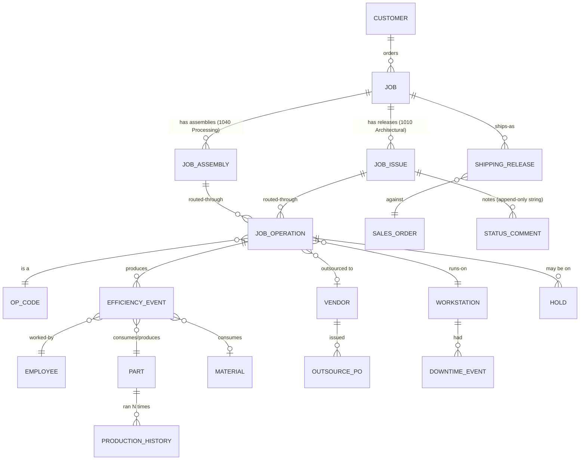

# Council Seat 2 — Data Model Reverse-Engineered

**Source artefacts analysed:**
- `/tmp/jwm-council/1010_A_shop_Production_Schedule.txt` — A Shop (Architectural / 1010 division), 20 sheets, ~4.8k lines
- `/tmp/jwm-council/1040_T_Shop_Production_Schedule.txt` — T Shop (Processing / 1040 division), 42 sheets, ~7.4k lines
- `/tmp/jwm-council/Daily_Efficiency_Log.txt` — Daily Efficiency Log, 18 sheets, ~4.5k lines

---

## TL;DR (what JWM actually tracks today)

JWM runs **two parallel parallel production operations in two spreadsheets plus one efficiency spreadsheet**, each workbook acting as a hand-rolled MES/ERP layer over Epicor. Between them they track:

1. **Jobs and their release lifecycle** — engineering → release → fabrication → coat/outsource → ship. The A-shop sheet alone has **177 columns** on one tab.
2. **Routing / operations per job** — up to 8 operation slots per job with sequence, start date, estimated hours, and machine/workstation assignment.
3. **Schedules per workstation** — 12+ workstation-specific tabs (AXYZ Titans, AXYZ 34, TruLaser 3040, 7000 TruMatic, 7000 TubeLaser 20/28, Clean and Brake, Fab, Shear, Cidan, Extrusion Saw, Punch, Roller, Brake, Weld, Robot Weld, PEM, ASM, Grind, Form, Level, Tube Laser, Flat Laser, MA, RW, Roll, Finish, Titus Weld, MacGyver Weld).
4. **Per-job-per-station daily efficiency** — by date × employee × operation × job × part, captured start/end time, qty req/complete, estimated PPH + men + hours, actual PPH + men + hours, material used vs. estimated, efficiency %, notes.
5. **Outsourcing pipeline** — jobs at each outside vendor (AAA, AZZ, POWDERWORX, TGS, COLBERT, DACODA, GLC), due-out, due-in, shipped qty, received qty, and overdue flags.
6. **Shipping pipeline** — open sales orders with ship-by, PO, order qty/shipped/open, sales value, current op, readiness flag.
7. **Inventory/PO staging** — open POs for outsourced processing, pre-production inventory with bin/warehouse/lot.
8. **Engineering workflow roles** — LO By, Sketch By, Check By, Correction By, AXYZ Prog By, Laser Prog By, Punch Prog By, Eng Manager, plus hold tracking (Eng Hold / Prog Hold / Process Hold / QC Hold) with start/end/days-on-hold counters.
9. **NCR / remake metadata** — Remake Piecemarks, Rework Release Type, Non-conformance #, RP Reason, RM Reason, Remake Request By.
10. **Running comment threads** — timestamped status notes appended with `*` delimiters in a single cell (e.g. `"03/30…Roller down*04/02…Roller still down*04/09…Roller still down*04/16/2026…Clean and Brake"`).

The spreadsheets are the system of record for **scheduling, efficiency, and cross-functional workflow**. Epicor is the system of record for **job numbers, part numbers, routings with op seq/op code, outsource POs, and financial facts**. Data flows Epicor → XLSX (paste / pull) and is then heavily enriched manually.

---

## File-by-file analysis

### 1010 A Shop Production Schedule.xlsx (Architectural / engineer-to-order)

**Sheet inventory (20 sheets, row counts approximate, includes header rows):**

| Sheet | Rows | What it is |
|---|---|---|
| Production Schedule | 2,611 | Master — one row per job-issue, 177 columns |
| Pre-Release | 96 | Filtered view of jobs not yet released to shop (in LO/Sketch/Eval/Float/Correction/Prog) |
| AXYZ Titans CNC Schedule | 15 | Queue view of AXYZ Titans Line work |
| AXYZ CNC Schedule | 70 | Queue view of AXYZ 34 |
| Clean and Brake Schedule | 86 | Queue for Clean-and-Brake station |
| Fab Schedule | 89 | Queue for Fab |
| Shear Schedule | 23 | Queue for Shear |
| Cidan Schedule | 21 | Queue for Cidan folder |
| Extrusion Saw Schedule | 6 | Queue |
| Punch Schedule | 8 | Queue |
| Roller Schedule | 5 | Queue |
| Ship Schedule | 295 | Bottleneck-by-ship-date analysis, `🔴/🟡/⚪` load markers |
| Notes | 326 | Per-job comment string + current/next station |
| Job Operations | 322 | Per-job routing with 6 op slots (Op1..Op6 + Start By dates) |
| Comments | 197 | Manager/eng comments |
| Lookup | 301 | ID list + filter box |
| Future Notes | 17 | Forward-looking notes |
| Meleta Schedule | 38 | Customer-specific queue (MALETA) |
| Forcast | 35 | Forecast view |
| Summary Dashboard | 26 | KPI tiles — Ships Today, Released Last 24h, Top 3 at station, counts |

**Entity: Job Issue (a.k.a. "release" or traveler-equivalent).** The Production Schedule sheet's 177 columns group into these buckets:

1. **Identity** — `Unique Tag`, `ID` (e.g. `24051-FS200`), `Duplicate Entry`, `Job Name`, `Job Address`, `Processing Customer No`, `Short Job No` (`24051`), `Release Type` (`FS` / `BM` / `RP` / `ST` / `MU` / `FL` / `RO`), `Release No`, `Rework Release Type`, `Nonconformance #`, `Release No H1`, `Highest Release`.
2. **Customer / PM** — `PM`, `PM Phone`, `System` (e.g. `400`, `600`, `CUSTOM ARCH`, `GRAVITY`, `TUBE SUPPORT SYSTEM`).
3. **Release notes** — free-text `Crating Plan`, `Release Notes`, `Description`, `Included with this issue`, `Misc Materials`, `Production Folder` (UNC path to job folder).
4. **Panel & part quantities** — `Percent Panels Released`, `Total Panels Released`, `Total Quoted Panels`, `Panel Qty`, `Part Qty`, `Sketch Qty`, `Extrusion Qty`, `Reveal LF`, `Program Material Qty`, `Prog Run Time` (duration `00d20h30m49s` or `18:17:07`).
5. **Material spec** — `Material`, `Material Type`, `Material Desc`, `Material Grain`, `Sheet Qty`, `Material In Stock`, `Material Date`.
6. **Engineering workflow** — `Outsource Eng`, `Outsource Eng Group`, `Ranked Priority`, `Days to Release`, `Responsible`, `Eng Manager`, `Evaluation By`, `LO By`, `LO Check By`, `Sketch By`, `Sketch Check By`, `Correction By`, `Eng Returned`, `AXYZ Prog By`, `Laser Prog By`, `Punch Prog By`, `Prog Complete`, `Prog Returned`, `Release By`.
7. **Date milestones** — `Date Submitted`, `Short Engineering Lead`, `Release To Shop Target`, `Released to Shop Actual`, `Short Fab Lead`, `Shop Complete By Date`, `Ship To Coating Target`, `Ship Target`, `Adjusted Ship Date`, `Requested Ship Date`, `Ship Actual`, `Ship To Coating Actual`, `Date Programming Received`, `Date Programming Complete`, `Date QC Received`, `Date Crating Received`, `Date Ready to Ship`.
8. **Coating / finish / outsource** — `Post Prod Coating`, `Coating Process`, `Vendor Coating Info`, `Post Coating Shipping Instructions`, `Screw Color`, `Screws Ordered`.
9. **Drawing deliverables** — `Shop Drawings`, `Scan`, `Scan Location`, `FD`, `FD Location`, `Calcs`, `Calcs Location`, `Remake Piecemarks`, `Original Release`, `RP Reason`, `RM Reason`, `Remake Request By`.
10. **Routing flags (per station)** — boolean-ish flags indicating the job passes through each station: `Station`, `LO`, `Sketch`, `CNC`, `Prog CNC`, `Vendor Cut`, `Flat Laser`, `Tube Laser`, `Prog Laser`, `Punch`, `Prog Punch`, `Roll`, `Shear`, `Cidan`, `Mill`, `Prog Mill`, `Extrusion Saw`, `1st Manual`, `Brake`, `Prog Brake`, `2nd Manual`, `Weld`, `Robot Weld`, `Prog Robot Weld`, `Metal Finish`, `CNB`, `Fab`, `Assembly`, `Tube Bender`, `Band Saw`, `5030`.
11. **Hold tracking** — four hold types with start/end/days-on-hold each: `Eng Hold` / `Prog Hold` / `Process Hold` / `QC Hold`, plus `Total Days On Hold`.
12. **Hour estimates by station** — `Drafting Hours`, `Shop Hours`, `Laser Hours`, `Punch Hours`, `Mill Hours`, `Roll Hours`, `1st Manual Hours`, `Brake Hours`, `2nd Manual Hours`, `Weld Hours`, `Assembly Hours`, `Tube Bender Hours`, `Band Saw Hours`.
13. **Shipping / crating** — `Partial Shipment`, `Shipping Method`, `Total # Crates`, `Total # Skids`, `Shipping Department`, `Ship Late`, `Ship v Target`.
14. **Derived / pivot helpers** — `Days In Programming`, `Days In QC`, `Days In Crating`, `Process Required Start Date`, `Week to Ship`, `Latest Comment`, `Department`, `Discard Issue`, `Inhouse PM`, `Inhouse Drafter`, `Inhouse Checker`, `Inhouse Name`, `Generate Inhouse (Manual)`.
15. **Misc** — `Program Lead`, `Programs Required`, `Required Processes` (multi-value cell with stations separated by newlines).

**Job Operations sheet** reduces that to a shop-floor-friendly view: `ID`, `Job Name`, `PM`, `System`, `Panel Qty`, `Part Qty`, `Material Type`, `Date Submitted`, `Ship Target`, `Shop Hours`, `Material In Stock`, `Current Station`, then 6 op slots (`Op 1`..`Op 6` + `Start By`), `Crating By`, `Notes`, `SortKey`, `Hours to complete job`.

**Volume / history:** Production Schedule has rows dating from 2024 (job numbers `24xxx`) through 2026 (`26xxx`). Notes have week-numbers going back to 2025 Week 08. This is effectively an open-ended history — nothing archived.

**Calculated vs. entered:**
- Calculated (formulas): `Days to Release`, `Days In Programming`, `Days In QC`, `Days In Crating`, `Days On Hold` (all four), `Total Days On Hold`, `Short Engineering Lead`, `Short Fab Lead`, `Ship v Target`, `Ship Late`, `Latest Comment`, `Week to Ship`, `Percent Panels Released`, `Process Required Start Date`.
- Entered: almost everything else including all role assignments, dates, quantities, notes. Hold start/end are manually toggled.

**Workflow cues:**
- Status = `Current Station` value (drives filtered schedules). Values seen: `LO`, `LO Check`, `Sketch`, `Sketch Check`, `Correction`, `Evaluation`, `Float`, `CNC Programming`, `Program Complete`, `Release to Shop`, `AXYZ Titans Line`, `AXYZ 34`, `AXYZ`, `TruLaser 3040`, `7000 TruMatic`, `7000 TubeLaser 20`, `7000 TubeLaser 28`, `TruPunch 5000`, `Clean and Brake`, `Shear`, `Cidan`, `Fab`, `Fabrication`, `Brake`, `Weld`, `Powder Coat`, `Assembly`, `Extrusion Saw`, `Roller`, `Tube Laser`, `Ready to Ship`, `RTS Titans`.
- Color/emoji coding: `🟢 ON TIME`, `🔴 OVERDUE`, `🟠 URGENT`, `🟡 SOON`, `⚪` normal, `❌ NOT FOUND`, `✅ FOUND`, `⏳ NOT READY`.
- Ownership by column: Eng Manager owns engineering block; Paul Roberts/Drew Adams drive release dates; each workstation lead owns their schedule tab; PM drives customer milestones.

---

### 1040 T Shop Production Schedule.xlsx (Processing / make-to-print)

**Sheet inventory (42 sheets):**

| Sheet | Rows | What it is |
|---|---|---|
| SUBCONTRACT STATUS REPORT | 400 | Pasted-in Epicor report: outsource jobs by supplier with Due Out/In/Qty |
| PRODUCTION REPORT | 414 | Pasted-in Epicor: open SO lines with qty/shipped/open/value |
| SHIPMENT TO SUBCONTRACTOR | 171 | Shipments out to subcontractors |
| JMW JOB OPERATIONS | 402 | Pasted-in Epicor: one row per job/op. Cols: Job Number, Customer Part, Our Part, Description, Rev, Asm, Op Seq, Start Date, Due Date, Est. Prod Hours, Job Req. By Date, Qty Req/Comp/Remain, Schedule Comment, ResourceID, Operation, Site, etc. |
| SCHEDULED SHIPMENTS REPORT | 303 | Epicor: ship-by report per order line |
| Open PO Report | 188 | Epicor: open POs with release dates per vendor |
| SHIPPING SCHEDULE | 401 | Enriched shipping view with `Days Until Ship`, `Priority` (🔴/🟠/🟡/🟢/✅), `Ready to Ship?`, `Staged Qty`, `Firm` |
| NOTES | 402 | Part × Job scheduling notes |
| Master | 402 | Master rollup: all jobs × all ops (up to 8) with Op Seq/Code/Start/Hrs each, Sales Rep, Coordinator, PO, Sales Value, `Staged Qty`, `Ready to Ship?`, `PEM/OS Sequence`, `Corrected PEM Start`, `Corrected OS Start`, `Uses Workaround` |
| PGM | 7 | Programming queue |
| PWX | 207 | Powder-coat queue (POWDERWORX) |
| Missed Outsource Receipts | 33 | Vendor-receive SLA failures |
| TL | 47 | Tube Laser schedule/queue |
| FL | 208 | Flat Laser queue — split into 1040 FL (Nortek only) and 3040 FL (everything else) |
| PU | 35 | Punch queue |
| FM | 190 | Form queue |
| FIN | 32 | Finish queue |
| MA | 16 | Machining queue |
| WE | 270 | Weld queue |
| GRINDING | 31 | Grind queue |
| PEM | 109 | PEM insertion queue |
| ROLL | 24 | Roll queue |
| SHEAR | 9 | Shear queue |
| ASM | 123 | Assembly queue |
| KIT | 142 | Kitting queue |
| OS | 401 | Outsource queue (rolled up) |
| QA | 401 | QA / inspection queue |
| SHIP | 30 | Ship queue |
| AAA / AZZ / TGS / COLBERT / DACODA / GLC | 8 / 10 / 37 / 17 / 8 / 6 | Per-vendor outsource schedules |
| ACCT | 11 | Accounting follow-up queue |
| LATE | 401 | Past-due jobs (Master-filtered by Shipping < today) |
| OS_Lookup | 402 | Cross-ref table: `Job_OpSeq` (e.g. `152719-1-1||50`), Vendor, ShippedQty, `AtOS` (checkbox), DueOut, RTS (ready-to-ship date), JobNumber, PartNumber, ReqQty, RecvQtyRemain |
| _Data / _Index | 402 / 402 | Helper tables that drive pivots & dropdowns |
| INVENTORY | 207 | Pre-production inventory lookup: Base Part Number, Part Number, Description, Lot Number, Qty On Hand, Bin, Warehouse, Has Stock? |

**Entity: Job Operation (processing flavor).** Unlike 1010 which is job-issue-centric, 1040 is operation-centric. The natural key is `Job_OpSeq` (e.g. `152384-12-7 / 0 / 40`) — **Job Number / Assembly (Asm) / Operation Sequence** — which Epicor uses natively.

Master sheet columns: `Job Number`, `Customer`, `Customer Part`, `Description`, `Rev`, `Qty Required`, `Qty Completed`, `Qty Remain`, then `Op N Seq`/`Op N Code`/`Op N Start Date`/`Op N Est Hrs` repeated for N=1..8, then `Shipping`, `Job Req. By Date`, `Sales Rep`, `Coordinator`, `PO Number`, `Sales Value`, `Customer Ship Date`, `Notes`, `Scheduling Notes`, `Staged Qty`, `Ready to Ship?`, `PEM/OS Sequence`, `Corrected PEM Start`, `Corrected OS Start`, `Uses Workaround`.

**Op codes** observed: `FM` (Form), `OS` (Outsource), `QA`, `WE` (Weld), `ASM` (Assembly), `FIN` (Finish), `PGM` (Program), `PWX` (Powder), `TL` (Tube Laser), `FL` (Flat Laser), `PU` (Punch), `MA` (Machining), `PEM`, `ROLL`, `SHEAR`, `KIT`, `SHIP`, `ACCT`, `GRINDING`. These match 1:1 with the sheet names — each sheet = queue for one op code.

**Subcontractors** observed: `AAA INDUSTRIES, INC.`, `AZZ METAL COATINGS`, `POWDERWORX 615 LLC` (`POWD615`), `TGS PRECISION`, `COLBERT MANUFACTURING, INC.`, `DACODA`, `GLC`. Each has its own tab. OS_Lookup is the cross-reference.

**Customers** observed (one per line in PRODUCTION REPORT column `Customer` + sheet headers): AKG North American Ops, BROCK GRAIN SYSTEMS, TGS PRECISION, COLLINS MANUFACTURING CO., COLBERT MANUFACTURING, AMERICAN FABRICATORS, PREMIER GLOBAL PRODUCTION, YANMAR AMERICA CORP, Olhausen, Nortek (called out separately in FL), Stock (internal build-to-stock).

**Calculated vs. entered:**
- Everything in Master + SHIPPING SCHEDULE + LATE + OS_Lookup + *_Data/_Index is formula-driven (looking at the Master sheet's sorted / filtered derivative nature).
- Source data (JMW JOB OPERATIONS, PRODUCTION REPORT, SUBCONTRACT STATUS REPORT, SCHEDULED SHIPMENTS REPORT, Open PO Report) is pasted from Epicor.
- Manually entered enrichments: `Scheduling Notes`, `Staged Qty`, `Firm`, `Uses Workaround`, `Corrected PEM Start`, `Corrected OS Start`, and the "checkbox" `☑/☐` in OS_Lookup `AtOS`.

**Workflow cues:**
- Status/priority emoji system same as 1010: 🔴 OVERDUE / 🟠 URGENT / 🟡 SOON / 🟢 OK / ✅ Ready / ⏳ NOT READY / ⚠️ LATE.
- Each op-code sheet filters Master by current op = that code; the LATE tab filters by Shipping < today.
- `Uses Workaround` flag + `Corrected PEM Start` / `Corrected OS Start` suggest JWM is working around Epicor scheduling bugs by capturing corrections in the spreadsheet.

---

### Daily Efficiency Log.xlsx

**Sheet inventory (18 sheets):**

| Sheet | Rows | What it tracks |
|---|---|---|
| Tube Laser | 251 | Daily efficiency by job/part at Tube Laser |
| Flat Laser | 252 | ditto at Flat Laser |
| Punch | 251 | ditto at Punch |
| Level | 250 | ditto at Level |
| Finish | 250 | ditto at Finish |
| PEM | 250 | ditto at PEM |
| ASM | 250 | ditto at Assembly |
| Form | 250 | ditto at Form |
| Weld | 251 | ditto at Weld |
| Titus Weld | 250 | ditto at Titus Weld cell |
| MacGyver Weld | 250 | ditto at MacGyver Weld cell |
| Grind | 250 | ditto at Grind |
| Robot Weld | 250 | ditto at Robot Weld |
| Roll | 250 | ditto at Roll (mostly empty / `#DIV/0!`) |
| MA | 250 | ditto at Machining |
| RW | 250 | ditto at RW |
| Data | 21 | Rollup: Operation → Monthly Efficiency %, Start Date, End Date + Shift lunch windows |
| Downtime | 400 | Date, Machine, Start Time, End Time, Total Hours, Notes |

**Entity: Daily Efficiency Event.** One row = one job-part-operator-station-day session. Natural grain: (Date, Job#, Part#, Employee, Operation) but keyed on operation by the sheet containing the row.

**Tube Laser columns (representative; other operation sheets use a subset with minor variations):**

| Group | Columns |
|---|---|
| Identity | `Date`, `Job#` (e.g. `143113` or `152739-4-1`), `Job Type` (Part/Batch/or repeated Job#), `Part#` (can be an Epicor item or a free-form customer ref) |
| Time window | `Start Time`, `End Time` |
| Qty | `Qty Required`, `Qty Complete`, `% Complete` |
| **Estimate side** | `PPH` (parts-per-hour estimate), `# of men`, `Total hours`, `Adj. Total Hours`, `Batch Hours` |
| Material estimate | `Material ID`, `Adj. Mat. Qty`, `Mat. Qty` |
| **Actual side** | `PPH Act`, `# of men Act`, `Total Hours Act`, `Act. Mat. Qty` |
| Setup | `Est. Hours`, `Act. Hours` (setup-only hours) |
| **Results** | `Efficiency` (Est. hrs / Act. hrs style ratio), `Job Efficiency` (only populated when job hits 100 %), `Mat. Over/Under`, `Total Job Mat O/U` |
| Commentary | `Notes` |
| Operator(s) | `Employee 1`..`Employee 4` |

**Data sheet** surfaces a one-operation-per-row monthly rollup:

```
Operation, Efficiency, Start Date, End Date
Tube Laser, 0.8906955595266253, 2026-04-01, 2026-04-30
Flat Laser, 0.9013998116133471, 2026-04-01, 2026-04-30
Punch,      1.0869981110783524, 2026-04-01, 2026-04-30
PEM,        0.4831801583226816, 2026-04-01, 2026-04-30
ASM,        0.5052941176470588, 2026-04-01, 2026-04-30
Form,       0.9777132799407298, 2026-04-01, 2026-04-30
Weld,       0.8640170489491669, 2026-04-01, 2026-04-30
MacGyver Weld, 1.1272688015406362, 2026-04-01, 2026-04-30
Grind,      0.7083333333333330, 2026-04-01, 2026-04-30
RW,         5.2210130743060095, 2026-04-01, 2026-04-30   ← almost certainly a data-quality red flag
```

This is **the** sheet Drew's email is asking about. It computes all five of his requested KPIs, but only at the aggregate monthly level. Row-level data supports operator, material, part.

**Date range sampled:** 2026-04-08 → 2026-04-15 (eight days sampled; sheets max at ~250 rows each, which at ~30 rows/day suggests ~8-10 days live history before rolling over).

**Calculated vs. entered:**
- Entered: Date, Job#, Part#, Start Time, End Time, Qty Complete, Employees, Notes, # of men Act, Material ID, Act. Mat. Qty.
- Calculated: % Complete, PPH Act, Total Hours Act, Efficiency, Job Efficiency, Mat. Over/Under. (Estimate side PPH / # men / Total hours come from routing / Epicor estimate.)

**Workflow cues:**
- Visible `#DIV/0!` / `#VALUE!` errors on Roll tab confirm manual maintenance.
- `Titus Weld`, `Robot Weld`, `Roll`, `MA`, `Level`, `Finish` have blank monthly efficiency — **they're only sometimes filled in** (depends on operator discipline).
- `RW = 5.22` is a massive outlier — either wrong estimates or unit-error — suggests no validation layer.
- Employee 1-4 columns imply multi-operator ownership per session.

**Downtime sheet** is sparse (2 filled rows in 400 pre-created empty rows) — captures machine outages, start/end/notes/total hours. An afterthought that isn't disciplined.

---

## Inferred operational data model



### Entities and their cardinalities

| Entity | Real-world | Grain | Cardinality / volume |
|---|---|---|---|
| **Customer** | TGS / AKG / Titans / Nortek / etc | one | ~10s of active customers |
| **Job** | Epicor Job Number `24051`, `152384`, `143113` | one per customer PO / work order | 100–200 active per PRD §1 |
| **Job Issue (1010)** | Releases `24051-FS200`, `24051-FS201` | one per released sub-scope of an architectural job | Production Schedule 2,611 rows with wide history; ~300 "live" per Summary Dashboard (`Total Active Jobs: 297`) |
| **Job Assembly (1040)** | `152384-12-7`, `152554-2-1` | Epicor Job / Asm / "-1" sub-part | JMW JOB OPERATIONS 400+ rows |
| **Job Operation** | `152384-12-7` op seq `20` `QA` | Job × Asm × OpSeq | 16–20K instances (PRD §1) — OS_Lookup uses `Job_OpSeq` key `152719-1-1\|\|50` |
| **Op Code** | FM/OS/QA/WE/ASM/FIN/PGM/PWX/TL/FL/PU/MA/PEM/ROLL/SHEAR/KIT/SHIP/ACCT/GRINDING/LO/Sketch/CNC/Cidan/Brake/Weld/Roller + 30+ in 1010 | controlled vocabulary | ~40 distinct codes across both shops |
| **Workstation / Resource** | `AXYZ Titans Line`, `AXYZ 34`, `TruLaser 3040`, `7000 TruMatic`, `7000 TubeLaser 20`, `7000 TubeLaser 28`, `TruPunch 5000`, `28 footer`, `20 footer` | physical machine or cell | 12–20 named stations |
| **Employee** | Jarett Matlock, Sterling Caldwell, Jason Thomason, Greland Crutchfield, Trevell Starnes, Brad Oliver, Jason T., Bud Ballard, Luca Ferrera, don, donnie, kevin, sam, chip, austin | operator | 30-50 actively appearing in efficiency logs |
| **Efficiency Event** | a single (day, job, part, station, employee) session | ~30 rows/day × 16 stations × 10 days visible = ~4,800 rows live; at 250/sheet cap: ~8–10 day rolling window | Key KPI grain |
| **Part / Item** | Customer part `NAS000056961`, Our part `12538-C`, `13881-B` | Epicor Part master | 10–20K active per PRD |
| **Material** | `RECT TUBE 5 X 2 X 11GA X 303" A36`, `4MM FR CORE MOONSTONE METALLIC`, `CSM-ACH2212190-21` | raw stock | ~100s of SKUs visible |
| **Hold** | Eng Hold / Prog Hold / Process Hold / QC Hold | per Job Issue × hold type | 0 or 1 active, history kept |
| **Outsource PO** | PO 12592 line 1 rel 6 | PO header + release | 188 rows open in 1040 Open PO |
| **Shipping Release** | SO 152384 line 12 rel 1 | sales order line/release | 303 in Scheduled Shipments |
| **Downtime Event** | machine down | per machine per window | sparse (~10/mo today, probably under-captured) |
| **Status Comment** | `"*04/16/2026…Sketch"` | appended into a single cell, `*`-delimited | multi-day history per job |
| **Production History** (Drew's "Part ran 5 times") | Aggregate of Efficiency Events grouped by Part | derived / query | ~1M parts/year per PRD |

### Relationships that JWM actually relies on

1. **Job ↔ Release (1010)** — join key is the short job `24051` → many issues `FS200/FS201/FS205/FS206/FS209.1/FS212/...`.
2. **Job ↔ Assembly (1040)** — Epicor structure `152384-12-7` = Job 152384, Asm 12, Part -7.
3. **Job Issue / Assembly ↔ Operation** — inline in both workbooks as "Op 1..Op 8" columns (Master sheet, Job Operations sheet). A relational system would have this as a one-to-many child table (`Job Operation`).
4. **Operation ↔ Workstation** — inferred from the Op Code (`FL` = Flat Laser) or the `Current Station` column. In the 1010 sheet there's an explicit Workstation per station flag.
5. **Efficiency Event → Operation / Part / Employee** — Daily Efficiency Log sheets are the join.
6. **Outsource Operation → Vendor → PO → Shipment** — traced via OS_Lookup, SUBCONTRACT STATUS REPORT, Open PO Report, SHIPMENT TO SUBCONTRACTOR.
7. **Holds → Job Issue** — captured inline on the row (not as a child table), which is the biggest data-modeling sin here.
8. **Comment threads → Job Issue** — append-only string in the `Notes` / `Latest Comment` / `Scheduling Notes` cells.

---

## Gap analysis vs current ERPNext demo

Current demo (per STACK_INVENTORY): Work Order (20), Job Card (7), BOM (11), Workstation (12), Operation (5), Stock Entry (29), Sales Order (6), plus custom DocTypes Project Traveler, NCR, JWM CAR, RMA, JWM Overrun Allocation.

Column → model mapping. Items marked **(GAP)** are new needs surfaced by this analysis.

| JWM field / entity | File | ERPNext home (native or custom) | Covered in demo? | Gap / change needed |
|---|---|---|---|---|
| Job Number (Epicor, `24051`, `152384`) | both | Work Order (name / ERPNext auto-naming) | Partial — demo uses `MFG-WO-2026-00001` | Add `jwm_epicor_job_no` text field, unique-index, carry legacy IDs |
| Job Issue / Release (`24051-FS200`) | 1010 | **(GAP)** No native concept | No | **New child DocType `JWM Job Release`** under Work Order, with release_no / release_type / parent_short_job |
| Release Type (FS/BM/RP/ST/MU/FL/RO) | 1010 | Custom field | No | Add `jwm_release_type` select on release |
| Panel Qty / Part Qty / Sketch Qty / Extrusion Qty / Reveal LF | 1010 | Work Order `qty` covers part qty only | Only `qty` | Add custom fields on Work Order: `jwm_panel_qty`, `jwm_sketch_qty`, `jwm_extrusion_qty`, `jwm_reveal_lf` |
| Material Type / Material / Material Desc / Material Grain | 1010 | Item (linked via BOM) | Covered via BOM/Item | Ensure Item has `jwm_material_type`, `jwm_has_grain` |
| Production Folder (UNC path) | 1010 | Custom field | No | Add `jwm_production_folder` text on Work Order/Traveler |
| Eng Manager / LO By / Sketch By / Check By / AXYZ Prog By / Laser Prog By / Punch Prog By / Release By | 1010 | **(GAP)** Role slots per job | No | **New child table `JWM Engineering Assignment`** with role + user, OR individual Link fields on the release |
| Eng / Prog / Process / QC Hold with start/end/days | 1010 | **(GAP)** Not natively a Hold record | Partial — Work Order has hold on/off | **New DocType `JWM Production Hold`** (parent: Work Order, type: select, start, end, computed days, reason) |
| Release Target / Released Actual / Short Lead / Ship Target / Ship Actual / Requested Ship / Adjusted Ship | 1010 | Mix: Sales Order delivery_date + Work Order `jwm_baseline_date` / `jwm_revised_date` | Partial | Add `jwm_release_to_shop_target`, `jwm_release_to_shop_actual`, `jwm_ship_to_coating_target/actual`, `jwm_adjusted_ship_date`, `jwm_requested_ship_date`, `jwm_ship_actual`. The baseline/revised pattern we already have generalises — need to extend to 6 paired date fields |
| Post Prod Coating / Coating Process / Vendor Coating Info | 1010 | Purchase Order (subcontract) + Item | Partial | Tag outsourced operations with `is_subcontracted=1`; create Vendor / Supplier master for AAA, AZZ, POWDERWORX, TGS etc. Add `jwm_coating_instructions` child |
| Shop Drawings / Scan / FD / Calcs + locations | 1010 | File attachments | Partial | Add 4 attach fields + location text fields to traveler |
| Routing flags (per-station booleans: LO, Sketch, CNC, Flat Laser, Tube Laser, …) | 1010 | Operation child on BOM / Work Order | Partial (demo has 5 ops) | Expand Operation master to ~40 codes (see table below); operations required are derived from traveler's route |
| Hour estimates per station (`Laser Hours`, `Brake Hours`, …) | 1010 | Operation child `time_in_mins` | Partial | Each traveler op row has its own estimate |
| Comments / Latest Comment / Scheduling Notes (append-only thread) | 1010 & 1040 | Comment / Communication | Covered | Preserve threading; migrate `*`-delimited strings into one Comment per entry |
| Op Seq / Op Code / Start Date / Est Hrs per op (up to 8 slots) | 1040 Master, 1010 Job Ops | BOM Operation + Job Card | Partial | Convert from "8 wide slots" to a proper Operation child table — already in our model |
| Qty Required / Completed / Remain (per job or per op) | 1040 | Work Order + Job Card | Covered | Add `qty_completed` / `qty_remaining` rollup on release |
| Rev / Customer Part / Our Part / Description | 1040 | Item (`item_code`, `item_name`, custom `jwm_customer_part`, `jwm_revision`) | Partial | Add `jwm_customer_part`, `jwm_revision`, `jwm_our_part` on Item |
| Staged Qty / Firm / Ready to Ship? | 1040 | Custom fields | No | Add on Sales Order line: `jwm_staged_qty`, `jwm_firm`, `jwm_ready_to_ship` (calc) |
| PEM/OS Sequence / Corrected PEM Start / Corrected OS Start / Uses Workaround | 1040 | **(GAP)** Epicor-workaround flags | No | Add `jwm_scheduling_override` child: original_start, corrected_start, reason |
| Sub-contract Status (DueOut/DueIn/Shipped/Received qty, AtOS checkbox) | 1040 | Purchase Order (subcontract), Stock Entry (Material Issue for subcontract) | Partial | Use native Subcontracting Order; add `jwm_at_os` checkbox & `jwm_due_out` date on line |
| Scheduled Shipments (ship by, ship via, firm, order/staged qty) | 1040 | Delivery Note / Shipping Schedule | Covered natively | Map Epicor fields |
| Open PO Releases (PO/Line/Rel/Due/Promise/Qty) | 1040 | Purchase Order schedule | Covered | Native |
| Daily Efficiency Event (date, job, part, times, qty, men, est/act PPH, est/act hours, est/act material, efficiency, employees) | Daily Eff | **(GAP)** Partially in Job Card but without PPH, men count, batch hours, or material variance | Minimal (Job Card captures qty + time) | **New DocType `JWM Efficiency Event`** (below) OR heavy extension of Job Card Time Log |
| PPH Est / PPH Act | Daily Eff | **(GAP)** | No | Add `jwm_pph_estimate`, `jwm_pph_actual` as rollup on operation master + per event |
| # of men Est / # of men Act | Daily Eff | **(GAP)** | No | Add `jwm_men_estimate`, `jwm_men_actual` on event |
| Batch Hours / Setup Est / Setup Act | Daily Eff | Operation master has setup, but no batch vs run distinction | Partial | Add `jwm_batch_hours`, `jwm_setup_est`, `jwm_setup_act` on event |
| Material ID + Adj Mat Qty / Est Mat Qty / Act Mat Qty / Mat Over-Under | Daily Eff | Stock Entry (material consumption) | Partial | Add `jwm_material_variance` computed on event; link Item |
| Efficiency % / Job Efficiency % | Daily Eff | **(GAP)** computed | No | Computed field + dashboard chart by operation / material type / operator |
| Employee 1–4 (operator(s) on the session) | Daily Eff | Employee (HR) linked on Job Card (single) | Partial | Add `jwm_operators` child table (Link Employee, primary flag) |
| Downtime (Date, Machine, Start, End, Hours, Notes) | Daily Eff | **(GAP)** | No | **New DocType `JWM Machine Downtime`** (Workstation link, start, end, hours computed, reason text, category select) |
| Operation monthly efficiency rollup | Daily Eff — Data tab | **(GAP)** | No | Report + dashboard chart (group by jwm_division / operation / material_type / operator) |
| Latest Comment / current status "04/16/2026…Sketch" | both | Work Order `status` + Comment | Partial | Add `jwm_current_station` link to Workstation; keep status distinct from station |
| Ship Late / Ship v Target (bool, computed) | 1010 | computed | No | Dashboard indicator |
| Days On Hold totals (per type + total) | 1010 | computed from JWM Production Hold | No | Report rollup |
| Ranked Priority | 1010 | Work Order priority | Covered | Map `Ranked Priority` to `priority` |
| Crating Plan / Total # Crates / Total # Skids / Shipping Method / Partial Shipment | 1010 | Delivery Note + Packing Slip | Partial | Add `jwm_crate_count`, `jwm_skid_count` |
| NCR#, Rework Release Type, RP Reason, RM Reason, Remake Request By | 1010 | Custom JWM NCR (demo) | Covered (we have NCR DocType) | Ensure fields map 1:1 |
| Non-conformance CAR / Overrun | 1010 implicit | JWM CAR, JWM Overrun Allocation (demo) | Covered | No change |
| Subcontract tracking per vendor tab (AAA/AZZ/POWDERWORX/TGS/COLBERT/DACODA/GLC) | 1040 | Supplier + Subcontract PO | Partial | Create Supplier master for each; every outsourced op becomes a Subcontract PO item |
| Inventory lookup (base part, part, desc, lot, qty, bin, warehouse) | 1040 INVENTORY | Item + Warehouse + Bin + Serial/Batch | Partial | Ensure Warehouse → Bin hierarchy, enable Batch tracking on relevant items |
| Outsource missed-receipt alerting | 1040 Missed Outsource Receipts | Report / email alert | No | Scheduled report + Notification rule |

---

## New DocTypes / Custom Fields we'd need for Epicor replacement

### Must-have new DocTypes

1. **`JWM Job Release`** (child of Work Order or standalone with Link)
   - `release_no`, `release_type` (select: FS/BM/RP/ST/MU/FL/RO/Other), `panel_qty`, `part_qty`, `sketch_qty`, `extrusion_qty`, `reveal_lf`, `material_type`, `material_grain` (bool), `production_folder` (URL/path), `system` (free text: 400/600/Custom Arch/Gravity/…), plus 6 paired target/actual dates.
2. **`JWM Production Hold`**
   - `parent_work_order`, `hold_type` (Eng/Prog/Process/QC), `start_date`, `end_date`, `days_on_hold` (computed), `reason`, `released_by`.
3. **`JWM Efficiency Event`**
   - `date`, `work_order`, `job_card`, `operation`, `workstation`, `item` (part), `material_item`, `start_time`, `end_time`, `qty_required`, `qty_complete`, `pph_estimate`, `pph_actual`, `men_estimate`, `men_actual`, `total_hours_estimate`, `total_hours_actual`, `batch_hours`, `setup_estimate`, `setup_actual`, `mat_qty_estimate`, `mat_qty_actual`, `material_variance` (calc), `efficiency_pct` (calc), `job_efficiency_pct` (calc, only when job complete), `notes`, child table `operators` → Employee Link.
4. **`JWM Machine Downtime`**
   - `date`, `workstation`, `start_time`, `end_time`, `total_hours` (calc), `category` (select: Mechanical / Electrical / Material / Operator / Scheduled Maint / Other), `notes`.
5. **`JWM Engineering Assignment`** (child of Work Order / Job Release)
   - `role` (select: LO / LO Check / Sketch / Sketch Check / Correction / Eng Manager / AXYZ Prog / Laser Prog / Punch Prog / Release), `user` (Link User), `assigned_date`, `completed_date`.
6. **`JWM Scheduling Override`** (child of Work Order Operation)
   - `original_start`, `corrected_start`, `reason`, `uses_workaround` (bool).

### Custom fields on existing DocTypes

| DocType | Field | Type | Notes |
|---|---|---|---|
| Work Order | `jwm_epicor_job_no` | Data | legacy `24051`, `152384`, unique index |
| Work Order | `jwm_short_job_no` | Data | `24051` (the short form) |
| Work Order | `jwm_current_station` | Link → Workstation | drives kanban |
| Work Order | `jwm_latest_comment` | Small Text | rolled up from Comments |
| Work Order | `jwm_crate_count`, `jwm_skid_count` | Int | |
| Work Order | `jwm_partial_shipment` | Check | |
| Work Order | `jwm_shipping_method` | Data | |
| Work Order | `jwm_requested_ship_date`, `jwm_adjusted_ship_date`, `jwm_ship_to_coating_target`, `jwm_ship_to_coating_actual`, `jwm_ship_actual`, `jwm_release_to_shop_target`, `jwm_release_to_shop_actual`, `jwm_shop_complete_by` | Date | |
| Work Order | `jwm_drafting_hours`, `jwm_shop_hours`, `jwm_laser_hours`, `jwm_punch_hours`, `jwm_mill_hours`, `jwm_roll_hours`, `jwm_1st_manual_hours`, `jwm_brake_hours`, `jwm_2nd_manual_hours`, `jwm_weld_hours`, `jwm_assembly_hours`, `jwm_tube_bender_hours`, `jwm_band_saw_hours` | Float | per-station estimate (or migrate to Operation table) |
| Work Order | `jwm_is_nortek` | Check | 1040 FL splits Nortek vs. other |
| BOM Operation / Work Order Operation | `jwm_op_code` | Link → Operation | `FM/OS/QA/WE/ASM/FIN/PGM/PWX/TL/FL/PU/MA/PEM/ROLL/SHEAR/KIT/SHIP/ACCT/GRINDING/LO/Sketch/…` |
| Operation (master) | `jwm_capacity_hours_per_day` | Float | static capacity (Phase 1 per PRD) |
| Operation | `jwm_division` | Select | reuse existing |
| Workstation | `jwm_resource_id` | Data | Epicor ResourceID e.g. `QA`, `FM` |
| Item | `jwm_customer_part` | Data | Customer's part no (`NAS000056961`, `40-000068`) |
| Item | `jwm_our_part` | Data | Our internal part code |
| Item | `jwm_revision` | Data | `A`, `B1.0`, `C.1` |
| Item | `jwm_material_type` | Link → (new) Material Type | `FR ACM`, `Steel Sheet`, `Alum Sheet`, `Galv Sheet`, `Alum Tube`, `Steel Tube`, `SS Sheet`, etc. |
| Item | `jwm_has_grain` | Check | |
| Sales Order Item | `jwm_staged_qty` | Float | |
| Sales Order Item | `jwm_firm` | Check | |
| Sales Order Item | `jwm_ready_to_ship` | Check (calc) | |
| Sales Order Item | `jwm_priority_emoji` | Data (calc) | 🔴/🟠/🟡/🟢/✅/⏳ (for display compatibility) |
| Purchase Order (Subcontract) | `jwm_at_os` | Check | |
| Purchase Order | `jwm_due_out_date` | Date | |
| Customer | `jwm_is_nortek` | Check | |
| Supplier | `jwm_subcontract_code` | Data | AAA/AZZ/POWDERWORX/TGS/COLBERT/DACODA/GLC |

### New value lists / Operation master seeding

Seed **~40 Operation records** covering everything in the spreadsheets:

- Engineering: `LO`, `LO Check`, `Sketch`, `Sketch Check`, `Correction`, `Evaluation`, `CNC Programming`, `Program Complete`
- Processing ops: `TL` (Tube Laser), `FL` (Flat Laser), `PU` (Punch), `SHEAR`, `CIDAN`, `FM` (Form/Brake), `ROLL`, `PEM`, `WE` (Weld), `Robot Weld`, `Titus Weld`, `MacGyver Weld`, `GRINDING`, `MA` (Machining), `RW`, `ASM` (Assembly), `KIT` (Kit), `FIN` (Finish)
- Architectural: `AXYZ Titans Line`, `AXYZ 34`, `AXYZ`, `TruLaser 3040`, `7000 TruMatic`, `7000 TubeLaser 20`, `7000 TubeLaser 28`, `TruPunch 5000`, `Clean and Brake`, `Fab`, `Extrusion Saw`, `Tube Bender`, `Band Saw`, `5030`, `Metal Finish`, `Mill`, `1st Manual`, `2nd Manual`, `Level`
- Outsource: `OS` (generic), `PWX` (Powder Coat), plus per-vendor child ops
- Terminal: `QA`, `SHIP`, `ACCT`, `Ready to Ship`, `RTS Titans`

---

## Drew's KPI list — data availability audit

Drew's email (Apr 17 2026) requests **five KPIs** plus **part performance history**. Mapping each:

| KPI | Data lives in today | Current demo coverage | Gap |
|---|---|---|---|
| **Efficiency % by operation** | Daily Efficiency Log — per-op sheets + Data rollup. Monthly aggregate computed at cell level. | Demo has no efficiency concept; Job Card captures time but no est-vs-act ratio. | **Need `JWM Efficiency Event` DocType + Dashboard Chart grouping by Operation.** Data is there row-level, just needs a target home. |
| **Job performance (based on efficiency)** | Daily Efficiency Log `Job Efficiency` column (only populated when job hits 100 % complete) | Not computed | **Rollup view**: for each Work Order, sum est hours vs sum act hours across all Efficiency Events. Surface in Work Order dashboard. |
| **Efficiency % by material type** | Daily Efficiency Log has `Material ID` per row; materials visible but no explicit material-type column — requires categorising `Material ID` strings (`RECT TUBE`, `HR ANGLE`, `CH454-20`, `AL CHANNEL`, `4MM FR CORE MOONSTONE…`). | No | **Need** `jwm_material_type` on Item (seeded from the 1010 `Material Type` list: FR ACM, Steel Sheet, Alum Sheet, Galv Sheet, SS Sheet, Alum Tube, Steel Tube, Alum Angle, Alum Pipe, SS Angle, Steel Custom Shape, Alum Channel, HR Angle). Efficiency Event → Item → Material Type → aggregate. |
| **Efficiency % by operator** | Daily Efficiency Log `Employee 1..4` columns — yes, per-session | No | Employee link on Efficiency Event (or child table for multi-op sessions). Dashboard chart groups by Employee. |
| **Estimated vs actual (labor)** | Daily Efficiency Log — both sides present (`Total hours` vs `Total Hours Act`, `Est. Hours` setup vs `Act. Hours`) | Partial (Job Card has planned_time + actual_time) | Efficiency Event captures it explicitly. Also need rollup to Operation and Work Order. |
| **Estimated vs actual (material)** | Daily Efficiency Log — `Adj. Mat. Qty` / `Mat. Qty` vs `Act. Mat. Qty` + derived `Mat. Over/Under`, `Total Job Mat O/U` | No | Need `material_variance` on Efficiency Event; or compute from Stock Entry consumption vs BOM estimate. |
| **Part performance history ("ran a part 5 times, how has it performed")** | Computable from Daily Efficiency Log aggregated by `Part#` | No | **New report `JWM Part Performance History`** — groups Efficiency Events by Item, shows: run count, avg efficiency, best/worst, trend, last-run date. Item master page gets a linked section. |

**Verdict for Drew's meeting**: all six are achievable with the proposed Efficiency Event DocType + three Dashboard Charts + one custom Report. The spreadsheets already carry the required raw fields — the gap is **a relational home and real-time rollup**, not data capture.

---

## Migration considerations

### Volumes

- **Work Order equivalents (Job Releases + Job Assemblies)**: 2,611 rows in 1010 Production Schedule + ~400 rows in 1040 Master = ~3,000 active records over an open-ended history. PRD §1 confirms 100-200 active POs, 16-20K operation instances.
- **Efficiency Events**: ~30 rows/day × 16 operations × ~260 business days/yr = ~125K rows/yr. Each sheet rolls at 250 rows so JWM is effectively only keeping 8-10 days of history in Excel — **moving to a DB recovers the full history**, a headline benefit to sell.
- **Parts / Items**: 10-20K active (PRD). The Inventory sheet is ~200 visible rows — clearly a filtered subset.
- **Subcontract POs**: 188 open releases in Open PO Report; 7 vendor tabs.
- **Shipping**: 303 lines in Scheduled Shipments Report, 401 in Shipping Schedule (active + recent history).

### Historical depth

- 1010 Production Schedule has jobs from 2024 job numbers (`24xxx`) through 2026 (`26xxx`). Conservatively 2.5 years of history.
- Daily Efficiency Log is short-horizon (days to weeks). Migration should pull **whatever is present**, warn the user that pre-cutover history is incomplete.
- Downtime is clearly under-captured. Expect low fidelity; useful as structure going forward but not as retrospective baseline.

### PII / sensitive columns

- **Employee names** in Daily Efficiency Log (full names, sometimes just first names `don`, `donnie`, `kevin`). Needs mapping to Employee master; GDPR-equivalent practice says this should live behind auth not in a free-share Excel.
- **PM phone numbers** on 1010 Production Schedule (e.g. `931.591.9340`, `980.246.6545`). Map to User profile.
- **Customer PO numbers + sales values** in 1040 PRODUCTION REPORT / SHIPPING SCHEDULE (`Sales Value` column in dollars). Currently copy/pasted from Epicor into a shared workbook — a data-security improvement to tout.
- **Job folders** (`Q:\Jobs\…` UNC paths) reveal internal network layout. Store as links; don't expose to shop-floor operators.

### Things that'll fight with ERPNext conventions

1. **"Release" concept (1010)**. ERPNext has Work Order, not WO-with-multiple-releases. Either treat each release as its own Work Order (loses the short-job grouping) or model Release as a child DocType. Recommend **standalone `JWM Job Release` DocType** that can optionally link to a parent Work Order / Project.
2. **Hold types as columns vs rows.** Spreadsheet has 4 columns (Eng/Prog/Process/QC Hold) per row. ERPNext expects a one-to-many Hold table. Data migration will pivot these 4 hold columns into up to 4 `JWM Production Hold` child rows.
3. **"Op 1..Op 8" wide layout.** Master sheet has 8 × (seq/code/start/hrs) = 32 columns. Epicor's JMW JOB OPERATIONS sheet already has this in long-format, so use that as the migration source — not Master.
4. **Free-form status comments with `*` delimiters.** Split by `*`, parse leading date token (`03/30…`, `04/16/2026…`) into Comment timestamps. Drop entries with unparseable dates into a single "Legacy notes" Comment.
5. **Emoji-encoded status (🔴/🟠/🟡/🟢)**. These are computed from dates — reconstruct as Dashboard Indicator rules, don't carry over as literal text.
6. **Part numbers are non-unique.** `Part#` column in Daily Efficiency Log sometimes holds Epicor item code (`NAS000056961`), sometimes customer ref (`13871--Upper Pipe`, `240316--Item 02`), sometimes Epicor part with suffix (`1502882700-2`). Need a canonicalisation step + `jwm_customer_part_ref` as a second searchable field.
7. **`Job#` sometimes has assembly/part suffix, sometimes not.** `143113` vs `152739-4-1` vs `152554-15-1`. Parse into `(job, asm, part)` tuple.
8. **Efficiency ratios contain outliers and `#DIV/0!` / `#VALUE!`**. Migration must filter/clamp (Data sheet shows RW = 5.22 monthly = almost certainly a unit error). Add validation on the Efficiency Event DocType.
9. **Subcontract as first-class.** Each outsource operation is really a Purchase Order → Subcontract flow. 1040's pattern of "tab per vendor" maps to Supplier master + filtered list view.
10. **Batch vs Part jobs.** `Job Type` column in Daily Efficiency has values `Part`, `Batch`, or echoes the job number. Model as `jwm_job_category` select on Work Order.
11. **Multi-operator sessions.** Employee 1-4 columns → child table. Demo currently assumes single operator on Job Card.
12. **Static vs dynamic capacity.** PRD §2 Non-Goal 6 says Phase 1 uses static capacity — aligns with the spreadsheets, which encode capacity as max hours per day per station (not visible in the extracts but used by the "Hrs to Complete CNC" calc). We can lift these numbers from the schedule tabs' formulas when we get the .xlsx formulas.
13. **The "Uses Workaround" flag.** JWM has already institutionalised Epicor scheduling bugs as data. Don't carry that over blindly — use the migration as a chance to normalise to correct PEM/OS start dates.

---

## Summary table for the quote-writer (Seat 4)

| Metric | Value |
|---|---|
| Spreadsheets reverse-engineered | 3 workbooks |
| Distinct sheets analysed | 80 |
| Max columns on a single sheet | 177 (1010 Production Schedule) |
| Active job-issue rows (1010) | 2,611 (297 "active") |
| Active job-op rows (1040) | ~400 Master, 16-20K operation instances per PRD |
| Distinct Op Codes / Workstations encountered | ~40 op codes, ~20 named workstations |
| Outsource vendors tracked | 7 named tabs (AAA / AZZ / POWDERWORX / TGS / COLBERT / DACODA / GLC) |
| Efficiency Events per year (estimated) | ~125K rows/yr |
| New DocTypes required for parity | 6 (Job Release, Production Hold, Efficiency Event, Machine Downtime, Engineering Assignment, Scheduling Override) |
| New custom fields on existing DocTypes | ~50 |
| Operation master records to seed | ~40 |
| Material Type seed values | 13+ |
| KPIs from Drew's email covered natively after build | 0 of 6 |
| KPIs covered after proposed new model | 6 of 6 |
| Spreadsheet-vs-ERPNext gaps requiring dev work | ~20 (listed above) |
| History window available for migration | 2024-01 → 2026-04 (~2.5 yrs) schedule data; ~10 days efficiency |
