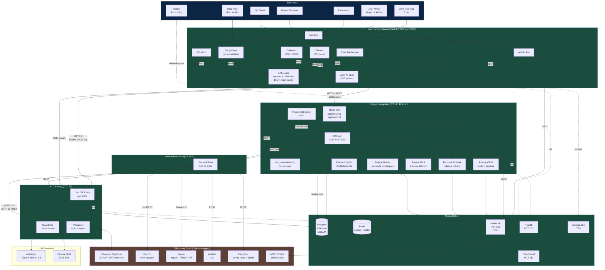

# Council Seat 6 — Reference Architecture

**Author:** Seat 6 (Reference Architect)
**Date:** 2026-04-17
**Status:** Opinionated reference for the full Epicor + Spectrum-capable replacement
**Companion docs:** [[JWM_Production_System_PRD_v0.2]] · [[PRD_ADDENDUM_built_state]] · [[STACK_INVENTORY]] · [[02-data-model-analysis]] · [[03-epicor-scope]] · [[04-commercial-quote]] · [[SYNTHESIS]]

---

## 0. Framing

Two non-negotiables anchor every decision below:

1. **ERPNext-native surface first.** A Frappe DocType beats a custom DocType; a custom DocType beats a script; a script beats a standalone service. Custom code is the last resort.
2. **Preserve the Next.js shell.** `jwm-demo.beyondpandora.com` is the face of the system. ERPNext Desk is reserved for system admins and Caitlin's finance workflows. Everyone else — Chris, George, Paul, Drew, Collin, estimators, planners, shop floor, QC — lives in the Next.js shell exclusively.

The architecture is therefore **ERPNext backbone + Frappe satellites for adjacencies + Next.js as the operational face + LiteLLM/n8n as connective tissue + a thin `jwm_manufacturing` Frappe app for the ~20% that is genuinely JWM-specific**. That's the whole story.

---

## 1. System architecture diagram



**Trust boundaries:**

- **Blue (JWM-owned):** end users, JWM's Spectrum/Paycor/Epicor/M365 tenants, and — by Phase 3 recommendation — all sovereign.ai-deployed infrastructure moved onto JWM-owned on-prem hardware.
- **Green (sovereign.ai-managed during Phase 1-2):** Next.js shell, ERPNext site, LiteLLM, n8n, Authentik, Traefik, Cloudflared, Ollama. Hosted on the beyondpandora.com homelab until the Phase 3 migration.
- **Brown (third-party SaaS):** Anthropic, ElevenLabs, Avalara, EasyPost. Accessed only through LiteLLM (LLMs) or n8n (business APIs) so JWM never has direct vendor lock-in in the data plane.

**Protocols on every arrow:**
- Shell → Frappe: HTTPS REST, token auth (`api_key:api_secret`), JSON.
- Shell → LiteLLM: HTTPS, Bearer virtual key, JSON (streaming via SSE for chat).
- Shell → ElevenLabs: proxied through `/api/ai/speak` (never client-direct; key stays server-side).
- ERPNext → n8n: Frappe webhook POST (document events: on_submit, on_update).
- n8n → Spectrum: SFTP file drop (nightly AP summary / job-cost batches) with REST fallback if Spectrum exposes one.
- n8n → Paycor: REST pull (daily), writes to Job Card via Frappe REST.
- Frappe Insights → Postgres: read-only replica connection (no write path).
- Authentik ← anything: OIDC code flow, JWT.
- All public ingress: Cloudflared tunnel → Traefik → service. No direct port exposure.

---

## 2. Component inventory

| # | Component | Role | Category | License | Deployment | Replaces | Interface |
|---|---|---|---|---|---|---|---|
| 1 | **ERPNext** | Backbone ERP: Sales, Purchase, Stock, Manufacturing, Quality, Projects, Accounting | Frappe-native | MIT | CT 171 (Docker, `jwm-erp.beyondpandora.com`) → on-prem Phase 3 | Epicor (all production modules), optionally Spectrum Phase 5 | `/api/resource/{DocType}`, `/api/method/{path}` + webhooks |
| 2 | **jwm_manufacturing** (Frappe app) | JWM-specific extensions: NCR, JWM CAR, RMA, Overrun, Project Traveler, 6 new DocTypes from Seat 2, custom print formats, brand CSS | Custom | proprietary to JWM | Bundled in CT 171 bench | — | Same Frappe REST surface |
| 3 | **Frappe CRM** | Leads, opportunities, pipeline for estimators/sales at $100M scale | Frappe ecosystem | GPLv3 | Same bench as ERPNext | (new — JWM has no CRM today) | Frappe REST; customers sync bidirectionally to ERPNext |
| 4 | **Frappe Insights** | Executive BI dashboards, exec-grade visualizations; optionally embedded in Next.js shell via iframe | Frappe ecosystem | AGPLv3 | Same bench | Supplements Archer's canned-analytics idea | Read-only Postgres replica; REST for embed |
| 5 | **Frappe Helpdesk** | Internal IT/ops ticket system (operator reports shop floor issues that aren't NCRs) | Frappe ecosystem | GPLv3 | Same bench | — (new) | Frappe REST |
| 6 | **Frappe Builder** | Low-code UI builder for admin-owned one-off forms, print formats, portal pages Paul builds himself | Frappe ecosystem | AGPLv3 | Same bench | — | Visual editor; output stored as DocType records |
| 7 | **Frappe LMS** | Phase 2+ — training delivery for new shop-floor hires | Frappe ecosystem | GPLv3 | Same bench (optional) | — | Frappe REST |
| 8 | **Next.js shell** | Custom operational UI — every non-admin daily workflow | Custom | proprietary to JWM | CT 120 port 3200 (systemd) | Epicor client, would-have-been-Smartsheet UI | Calls ERPNext REST + LiteLLM |
| 9 | **LiteLLM Gateway** | Unified LLM proxy: Anthropic Claude, local Ollama, guardrails, audit, spend caps | Third-party OSS | MIT | CT 123 port 4000 | — | HTTPS OpenAI-compatible API |
| 10 | **Ollama (GPU)** | Local LLM fallback for sovereignty-sensitive prompts | Third-party OSS | MIT | PCT 146 (RTX A4000) | — | LiteLLM upstream only |
| 11 | **n8n** | Workflow orchestration: Spectrum/Paycor/Epicor integrations, scheduled AI jobs, webhook routing | Third-party OSS | Sustainable Use License (OSS-ish) | CT 107 | Smartsheet Data Shuttle + Data Mesh + parts of Control Center | Webhooks, REST HTTP nodes, cron |
| 12 | **Authentik** | OIDC SSO for every service | Third-party OSS | MIT | PCT 105 | — | OIDC / SAML |
| 13 | **Traefik** | Reverse proxy + Let's Encrypt + routing | Third-party OSS | MIT | PCT 103 | — | HTTP/TLS |
| 14 | **Cloudflared** | Public tunnel, no inbound ports | Third-party SaaS | Cloudflare free tier | PCT 113 | — | Tunnel to Traefik |
| 15 | **Postgres** | Backing store for ERPNext + LiteLLM audit + read replica for Insights | Third-party OSS | PostgreSQL License | CT 171 (primary) + replica on same host | Epicor SQL Server | TCP 5432 |
| 16 | **Redis** | Frappe queue + cache + socketio | Third-party OSS | BSD-ish | CT 171 | — | TCP 6379 |
| 17 | **ElevenLabs TTS** | John's voice (Adam) for shop-floor hands-free readback | Third-party SaaS | commercial | — | — | REST (proxied server-side) |
| 18 | **Web Speech API** | In-browser speech-to-text for voice input | Browser built-in | — | Client | — | JS API |
| 19 | **Anthropic API** | Primary LLM for Claude Sonnet 4.6 | Third-party SaaS | commercial, `no_training=true` | — | — | Through LiteLLM only |
| 20 | **Avalara AvaTax** | Multi-state sales tax (added Phase 2) | Third-party SaaS | commercial | — | — | REST via n8n |
| 21 | **EasyPost** | Parcel/LTL rate shop, label print (added Phase 3) | Third-party SaaS | commercial | — | — | REST via n8n |
| 22 | **Viewpoint Spectrum** | GL, AP, AR, retention, progress billing (AIA G702/G703) — JWM's existing construction accounting | Third-party SaaS | — | JWM-managed | (preserved) | SFTP primary, REST if exposed |
| 23 | **Paycor** | Time & payroll — pushes labor hours inbound to ERPNext Job Cards | Third-party SaaS | — | JWM-managed | (preserved) | REST inbound via n8n |
| 24 | **Epicor** | Legacy ERP — Phase 4 decommission end of Q1 2027 | Third-party SaaS | — | JWM-managed | **replaced** | REST + DMT export during migration only |

**Intentionally not included:**

- **Paperless-ngx** — the original PRD §5.5 called for it; the demo ships without it and hasn't needed it. Frappe's native File Manager + `File` DocType with auto-OCR on PDF attachments (the Claude estimator flow already does this at extraction time) covers the MVP case. Recommended decision: **skip Paperless-ngx in Phase 1-3; revisit only if Phase 4 audit-retention requirements demand a dedicated DMS**.
- **Frappe HR** — JWM uses Paycor. Skip entirely.
- **Frappe Gameplan** — JWM uses Teams. Skip entirely.
- **Frappe Drive** — Native File Manager covers file attachments; full Drive would duplicate what Teams/SharePoint already does. Skip unless Phase 5 specifically replaces Teams.

---

## 3. Data flow walkthroughs

Every flow below uses the same concrete stack: user clicks a button in Next.js → Next.js API route → ERPNext REST or LiteLLM → response. Webhooks from ERPNext fire into n8n for side-effects (notifications, integration pushes). Nothing goes direct to Anthropic from the browser.

### 3.1 Estimate PDF → Released Work Order

```
Estimator              Next.js Shell           ERPNext                 LiteLLM/Claude
    |                        |                    |                          |
    |-- drop PDF ----------->|                    |                          |
    |                        |-- pdf-parse (server-side)                     |
    |                        |-- POST /api/estimator/extract                 |
    |                        |---- Bearer JWM key, streaming --------------->|
    |                        |                                           (structured
    |                        |                                            extraction
    |                        |                                            ~30-45s)
    |                        |<-- SSE stream: status, then JSON BOM -------- |
    |<-- BOM tree UI --------|                    |                          |
    |-- edit qty/price ----->|                    |                          |
    |-- click "Create WO" -->|                    |                          |
    |                        |-- POST /api/resource/Quotation -------------->|
    |                        |   (with child Estimated BOM, jwm_division)    |
    |                        |<----- 201 created --{Quote name}--------------|
    |                        |                                               
    |                        |-- server Action "Submit Quote → SO" ---------->|
    |                        |   (Frappe: frappe.client.submit + workflow)   |
    |                        |<----- Sales Order created --------------------|
    |                        |-- Server Action "Create Work Order from SO" ->|
    |                        |<----- Work Order in Draft ---------------------|
    |                        |-- PATCH Work Order status=Released ----------->|
    |                        |<----- 200 --- (webhook fires to n8n) ---------|
    |<-- redirect /planner/WO-2026-XXXXX                                      |
```

Side-effects on release (via Frappe webhook → n8n):
- n8n drops a pre-rendered traveler PDF (Frappe Print Format with QR) into `/shared/travelers/`.
- Email to planner (via Frappe Email Queue, not n8n — native is sufficient).
- Insights dashboard auto-increments "released this week" KPI on next refresh.

Key architectural property: **the Next.js shell never invents business logic**. Quotation → Sales Order → Work Order transitions are all native ERPNext server actions. Shell just triggers them.

### 3.2 Shop Floor Job Card lifecycle

```
Welder tablet           Next.js /shop/weld-bay-a       ERPNext
    |                        |                             |
    |                        |-- poll every 10s: GET /api/method/jwm.shop.queue?ws=weld-bay-a
    |                        |<-- queue JSON (cached 10s) ------|
    |-- tap Job Card ------->|                             |
    |-- tap Start ---------->|                             |
    |                        |-- POST /api/method/jwm.shop.start_jc
    |                        |   {jc: JC-..., operator: E-...}  |
    |                        |<-- updated Job Card -------------|
    |-- enter qty, scrap --->|                             |
    |-- tap Complete ------->|                             |
    |                        |-- POST jwm.shop.complete_jc
    |                        |   → native Frappe creates Stock Entry
    |                        |     (type: Material Transfer for Manufacture)
    |                        |   → JWM Efficiency Event created (hook)
    |                        |   → on scrap>0, scrap Stock Entry
    |                        |<-- completion response ----------|
    |<-- checkmark, next --  |                             |
```

Scrap threshold trigger fires via a `doc_event` hook in `jwm_manufacturing`:
- Stock Entry on_submit → if scrap_qty / total_qty > threshold → enqueue n8n webhook → n8n calls `/api/anomaly` (LiteLLM) → if flagged, draft NCR via `/api/ncr/draft` → POST new NCR to ERPNext → shell SSE pushes notification to QC inbox.

Voice NCR path runs inside the same kiosk screen (`/shop/[workstation]` → "Report Issue"):
- Browser Web Speech API → transcript to Next.js → `/api/ncr/draft` → LiteLLM vision-capable call → structured NCR JSON → POST to ERPNext NCR DocType → shell redirects to `/qc/NCR-...`.

### 3.3 Procurement → Subcontract → Receipt

```
Planner Next.js         ERPNext                        Supplier (manual email/portal)
   |                       |                                  |
   |-- "Create Material Request from WO shortage" ----------->|
   |                       |   (Frappe native: WO → MR)       |
   |                       |<-- MR created                    |
   |-- request for quote ->|                                  |
   |                       |-- Supplier Quotation DocType --->|
   |<-- compare quotes ----|                                  |
   |-- select & PO -------→|                                  |
   |                       |-- Purchase Order (w/ subcontract flag) -->|
   |                                                          | [manual: email PO]
   |                                                          |
   |-- goods dispatch ---->|-- Subcontract Order (native) --->|
   |                       |   → Material Issue Stock Entry    [ship material to supplier]
   |                                                          |
   |                                            [supplier performs op]
   |                                                          |
   |<-- receipt at dock ---|-- Purchase Receipt (native)      |
   |                       |   → finished op Stock Entry       |
   |                       |   → WO operation marked complete  |
   |                       |   → n8n webhook: missed-receipt   |
   |                       |     check against jwm_due_out_date|
   |                       |                                  |
   |-- supplier invoice -->|-- Purchase Invoice (native)      |
   |                       |   → 3-way match (PO/receipt/invoice)
   |                       |   → webhook to n8n → Spectrum AP journal (nightly batch)
```

The seven JWM subcontract vendors (AAA, AZZ, POWDERWORX, TGS, COLBERT, DACODA, GLC) each become native `Supplier` records with `jwm_subcontract_code`. The per-vendor spreadsheet tabs become saved Report Builder views filtered by supplier. **No custom DocType needed** — native ERPNext subcontracting handles all of it.

### 3.4 Customer payment cycle (construction-aware)

```
Shipping Next.js       ERPNext                     Spectrum (JWM-managed)
   |                      |                              |
   |-- Delivery Note ---->|                              |
   |                      |-- Sales Invoice (auto on DN submit)
   |                      |   if jwm_is_construction_project=1:
   |                      |     → use AIA G702/G703 print format
   |                      |     → withhold jwm_retention_pct
   |                      |   else: standard invoice
   |                      |                              |
   |                      |-- nightly n8n batch --------->|
   |                      |   SFTP CSV: invoice header + lines
   |                      |                              |
   |                                                [Caitlin posts AR]
   |                                                [payment received in Spectrum]
   |                                                     |
   |                      |<-- nightly n8n pull ---------|
   |                      |   (payment status CSV)        |
   |                      |-- Payment Entry (cash app)    |
   |                      |   → Sales Invoice marked paid |
```

**Critical decision point:** which system owns the invoice? See §5 — recommended **Phase 2-4: ERPNext owns manufacturing invoices and posts a summary AP/AR journal to Spectrum**. Spectrum continues to own retention release, AIA progress billing on pure construction projects (rare for JWM — they're a metal fab, not a GC), and month-end GL.

The AIA G702/G703 print format lives in `jwm_manufacturing` as a Jinja-rendered Frappe Print Format. Retention tracking is a custom field on Sales Invoice (`jwm_retention_pct`, `jwm_retention_held`) plus a linked `Journal Entry` for the retention receivable.

### 3.5 Month-end close

```
Caitlin ERPNext Desk       ERPNext                  Spectrum
  (bypass shell)             |                        |
   |                         |                        |
   |-- run subsidiary ledger validation (Frappe Report)
   |<-- variance report      |                        |
   |-- post adjusting JEs -->|                        |
   |                         |                        |
   |-- close period --------→|                        |
   |                         |-- period close snapshot |
   |                         |                        |
   |-- n8n scheduled: end-of-month job cost summary batch
   |                         |-- aggregate Work Order costs
   |                         |   (labor from Job Cards + material from Stock Entries + subcontract from POs)
   |                         |-- SFTP summary journals → Spectrum
   |                                                  |
   |                                             [Caitlin posts to GL]
   |                                             [produces financial statements in Spectrum]
   |
   |-- Chris opens Next.js /dashboard/financials (Phase 2+)
   |   → Frappe Insights iframe embedded in the shell
   |   → reads from Postgres replica, shows revenue, gross margin, WIP, scrap cost
```

**Caitlin's workflow stays in ERPNext Desk, not the Next.js shell.** Month-end close is a specialist tool; the shell is an operational tool. Drawing that line is deliberate.

### 3.6 Anomaly detection + AI insight loop

```
n8n (scheduled, daily 02:00)    ERPNext                 LiteLLM                Next.js shell
        |                          |                      |                         |
        |-- GET /api/resource/Stock Entry?filters=[...last 7d, scrap]
        |<---- 200 with N scrap events                                              |
        |                          |                      |                         |
        |-- POST /chat/completions (LiteLLM)              |                         |
        |   system: "Analyze these scrap events for patterns"
        |   user: [serialized events]                                                |
        |<----- Claude: "Pattern detected: Laser #2 kerf drift 3x in 48h"            |
        |                          |                      |                         |
        |-- POST /api/method/jwm_manufacturing.anomaly.log|
        |                          |   creates JWM Anomaly DocType                  |
        |                          |   (new doc: type, severity, evidence, hypothesis)
        |                          |                                                 |
        |-- Frappe webhook on JWM Anomaly.on_insert → SSE push                      |
        |                                                                 → shell banner
        |                                                                 → dashboard card
        |                                                                 → email QC lead (native)
```

Optional automatic escalation: if severity ≥ Major, n8n calls `/api/ncr/draft` with the anomaly context, creates a draft NCR attached to the anomaly, and routes it to QC for review instead of waiting for an operator to notice.

**Key property:** the anomaly detector is a scheduled job, not a live hot path. LLM cost stays ~$0.01-0.05 per run, budget-safe.

---

## 4. The custom shell layer — what lives where

### 4.1 Principle

The Next.js shell is a **thin opinionated client** over Frappe REST. It holds no business state that isn't in ERPNext; it invents no entity that doesn't have a DocType; it caches aggressively (10s in-memory TTL for read-mostly endpoints) and streams for anything that takes >1s.

### 4.2 Architectural contract

- **Auth:** Authentik OIDC → Next.js session cookie (httpOnly, 12h). Shell never stores Frappe tokens client-side; all Frappe calls go through Next.js API routes which hold a single service-account token.
- **Data layer:** `lib/erpnext.ts` wraps `/api/resource` and `/api/method` with typed helpers. Every endpoint has a corresponding canned fallback in `lib/canned/` (already built) for demo resilience and offline dev.
- **Caching:** in-memory LRU on the Next.js server with 10s TTL for dashboards/queues, 60s for master data (customers, items), no cache for writes. Simple and adequate to 50-100 concurrent users; swap to Redis behind the shell if scale demands (Phase 3+).
- **AI layer:** `lib/litellm.ts` handles all LLM calls. Shell-to-LiteLLM is SSE for chat, plain JSON for one-shot extractions.
- **Writes:** every write is a Frappe REST POST/PUT. Optimistic UI permitted on low-risk operations (quantity updates on Job Cards) with rollback-on-error. Destructive operations require confirmation and a server round-trip.
- **Error handling:** shell never eats a Frappe error. 4xx surfaces as a toast with Frappe's own error message; 5xx surfaces with a retry option and logs to console + server.

### 4.3 The line between shell and ERPNext Desk

**Shell (daily operational UI):**
- Executive dashboard + NL chat
- Estimator PDF→BOM flow
- Planner Work Order detail + release
- Shop floor kiosks (12 workstations)
- QC inbox + NCR/CAR review
- Shipping queue (Phase 3)
- Purchasing dashboard for Drew (Phase 3)
- Project rollup for Josh (Phase 2)
- Part performance history for Collin (Phase 1, extended Phase 2)

**ERPNext Desk (admin + finance only, reached via `/admin/jump-to-desk`):**
- DocType schema changes, custom fields, print format editing
- User + Role management, permission matrix
- Month-end close (Caitlin)
- Journal Entry posting
- Fixed Asset management (if it ever comes in-house)
- Data Import Tool for bulk corrections
- Frappe Report Builder for ad-hoc queries Paul wants to build for himself
- System settings, scheduler job tuning

The shell admin page shows one button: **"Open in ERPNext Desk"** that jumps to the equivalent DocType view with SSO already passed through.

### 4.4 Why not just ERPNext Desk everywhere?

Three reasons Chris won't let you:

1. **Aesthetics.** JWM's brand is specific (navy + gold, 1938 heritage, certifications). Frappe Desk's UI — while functional — looks like an admin tool. The shell is a marketing-grade operational UI that doubles as a recruiting asset for JWM.
2. **Task focus.** Desk shows every field of every DocType by default. A welder needs three buttons: Start, Complete, Report Issue. The shell's role-per-URL model makes each role's view narrow and tactile.
3. **AI-native interactions.** The chat drawer, the anomaly card, the voice NCR, the streaming extractor — these are first-class in the shell and awkward-to-impossible in Desk.

The payoff for keeping Desk available: Paul, Drew, and sovereign.ai ops can do 80% of admin work without custom-building admin pages in Next.js. That's a massive effort save.

---

## 5. Decisions requiring input

Each call is framed as **recommendation / alternative / switch condition**.

### 5.1 ERPNext Accounting vs keep Spectrum

- **Recommend:** Keep Spectrum through Phase 4. ERPNext owns Purchase Invoices and Sales Invoices operationally; Spectrum owns GL, AR cash app, retention release, month-end financial statements. n8n ships summary journals between them.
- **Alternative:** Phase 5 (2027+) migrate accounting to ERPNext Accounting entirely, decommission Spectrum. Save ~$15-25K/yr in Spectrum fees.
- **Switch condition:** Do it if (a) Spectrum's construction features (retention, AIA, progress billing) aren't actually used heavily — JWM is a metal fab, not a GC, and retention may apply only to <10% of revenue; AND (b) Caitlin is open to a platform change. If either fails, keep Spectrum.
- **Why:** Spectrum replacement is a 3-6 month project of its own with accountant retraining, audit re-validation, and opening-balance reconciliation. Not worth disrupting unless there's a business reason. Phase 1-4 delivers Epicor retirement; accounting migration is a cleanly-separable optional follow-on.

### 5.2 Frappe CRM vs ERPNext built-in CRM vs status quo

- **Recommend:** Stand up **Frappe CRM** in the same bench during Phase 2. More modern pipeline UI, dedicated for sales activity, integrates natively with ERPNext Customer master.
- **Alternative:** Use ERPNext's built-in `Lead` and `Opportunity` DocTypes. Works fine but the UX is generic Desk.
- **Switch condition:** Go with built-in if Chris prefers single-app simplicity AND JWM's sales motion is ≤5 active sellers. Go with Frappe CRM if JWM plans to hire more sellers on the way to $100M, OR wants pipeline visibility in a modern dashboard.
- **Why:** Free upside, clean integration, and growing-into-it is easier than retrofitting later.

### 5.3 Frappe Insights vs Next.js-native dashboards

- **Recommend:** **Both, layered.** Hero KPIs and real-time operational widgets stay in the Next.js shell (already built). Frappe Insights handles deep slice-and-dice BI for Chris/George at the exec level and is **embedded via iframe inside `/dashboard/deep`** in the shell so the user experience is unified.
- **Alternative:** Only Insights (retire the Next.js dashboard widgets). Or only Next.js dashboards (skip Insights entirely).
- **Switch condition:** Go Insights-only if Chris says he wants to build his own dashboards without developer help. Go Next.js-only if deep BI is a Phase 5 concern and Phase 1-4 scope has no room.
- **Why:** Insights gives Chris a self-service BI surface without needing Matt to build each new chart. Next.js dashboards give the *shape* Chris saw in the demo.

### 5.4 On-prem migration at Phase 3 vs stay cloud

- **Recommend:** **On-prem at Phase 3 cutover** (Jan 2027). Single box: ~32-core / 128GB / NVMe + ZFS / 25Gbps nic, ~$18-25K one-time. Runs Proxmox, mirrors the existing homelab topology (same LXC IDs, same Traefik config, same Authentik), everything-as-code via existing Ansible/compose files. Saves ~$12-18K/yr in cloud fees from Year 2.
- **Alternative:** Stay on sovereign.ai-managed AWS or JWM-owned AWS. OpEx shape; no hardware to own.
- **Switch condition:** Stay cloud if JWM IT explicitly does not want hardware in a closet. Move on-prem if Chris sees infra ownership as strategic.
- **Why:** JWM already has physical facilities. The homelab pattern is proven at beyondpandora.com. On-prem eliminates data egress worries and the $100M-scale AWS bill trajectory. **This is also the right moment for it** — Phase 3 is already a hard cutover week; layering the hardware swap into the same event adds ~2 days of planning and saves future disruption.

### 5.5 n8n vs ERPNext native Scheduler

- **Recommend:** **Both, by role.** n8n handles anything that crosses a trust boundary (Spectrum, Paycor, Avalara, EasyPost, Anthropic outside the gateway) or needs visual debugging. ERPNext Scheduler handles everything purely inside the Frappe bench (daily anomaly prep, email queue flushes, archive jobs, Insights refreshes).
- **Alternative:** n8n for everything. Or Scheduler for everything with REST calls in Python.
- **Switch condition:** Go n8n-only if JWM wants a single orchestration tool to monitor and debug. Go Scheduler-only if JWM wants to retire n8n to simplify the stack (but this is a real feature regression for integrations).
- **Why:** Each tool is best at its native job. Splitting along the trust boundary makes debugging clear — "did it fail inside Frappe or outside?"

### 5.6 LiteLLM placement — CT 123 vs co-located with ERPNext on CT 171

- **Recommend:** **Keep CT 123 (separate).** It's a gateway, not a plugin. Separation lets us version Claude/Ollama independently of ERPNext upgrades, swap providers without touching the ERP, and rate-limit at the network edge before anything hits the Frappe workers.
- **Alternative:** Co-locate on CT 171. Fewer moving parts.
- **Switch condition:** Co-locate only if we're simplifying the stack for a single on-prem server deployment AND the network-layer isolation isn't needed (tiny customer, low volume).
- **Why:** Gateway separation is a security and operational principle. The cost of the extra container is negligible.

### 5.7 Paperless-ngx vs Frappe File Manager

- **Recommend:** **Skip Paperless-ngx.** Frappe's File Manager + attachment fields on DocTypes + LLM-at-extraction-time (the estimator flow already does OCR via Claude) covers the use cases. Paperless-ngx adds an OCR index, tag system, and retention policy engine that JWM hasn't asked for.
- **Alternative:** Deploy Paperless-ngx in Phase 3+ if audit/compliance requires a formal records-management system.
- **Switch condition:** Deploy only if (a) an auditor explicitly asks for document-retention timestamps, or (b) JWM wants searchable archive across non-ERP documents (drawings, customer specs, historical correspondence).
- **Why:** Paperless-ngx is a solution to a problem JWM doesn't have yet. Skip it and save the infra/maintenance.

---

## 6. Phased build-out as architecture deltas

### Phase 1 (live, 2026-04-17)

**Live components (sovereign.ai-managed on beyondpandora.com homelab):**
- Next.js shell (CT 120:3200)
- ERPNext + `jwm_manufacturing` app (CT 171)
- LiteLLM (CT 123) + Ollama fallback (PCT 146)
- Authentik (PCT 105), Traefik (PCT 103), Cloudflared (PCT 113)
- n8n (CT 107) — skeleton workflows only

**JWM-owned:** nothing yet (Spectrum, Paycor, Epicor, M365 pre-existing).

**Custom surface:** 5 existing custom DocTypes (NCR, JWM CAR, RMA, Overrun, Project Traveler) + 7 custom fields + brand CSS + 1 print format. Shell has 7 pages and 8 API routes.

### Phase 2 (+Aug-Oct 2026)

**Adds:**
- Frappe CRM enabled in the same bench
- Avalara integration via n8n (new workflow)
- Paycor integration hardened (real creds, prod cadence)
- Spectrum outbound hardened (AR invoice feed + AP summary journals)
- 6 new DocTypes from Seat 2 (Job Release, Production Hold, Efficiency Event, Machine Downtime, Engineering Assignment, Scheduling Override)
- ~50 additional custom fields
- Engineering Change Order DocType
- Shell pages added: `/sales/pipeline` (CRM embed), `/estimator` extended with Quotation linkage, `/projects/[project]` rollup
- Frappe Insights stood up for Chris (new workspace in same bench)

**JWM-owned:** still nothing beyond the pre-existing SaaS.

### Phase 3 (Oct 2026-Jan 2027) — the big one

**Adds:**
- EasyPost integration via n8n
- Item Master + BOM migration from Epicor (15-30K items)
- Perpetual inventory go-live (warehouse hierarchy, bins, back-flush, cycle count)
- Subcontracting workflow with 7 vendors
- Zebra label printing (new API route in shell, ZPL templates in `jwm_manufacturing`)
- Barcode/QR scanner support in shell (camera-based + USB HID)
- CAD/CAM file-drop via n8n filesystem watcher

**Architecture shift:**
- **On-prem migration.** Single box goes live at a JWM facility. DNS cut-over `jwm-erp.*` and `jwm-demo.*` from beyondpandora.com to JWM's on-prem Traefik. Cloudflared tunnel repointed.
- Sovereign.ai retains admin/maintenance VPN access; JWM owns the physical hardware, the Proxmox root password, and the ZFS snapshots.
- Redis upgraded from shared with other sovereign.ai services to dedicated for JWM ERPNext.

**JWM-owned by end of Phase 3:** the on-prem hardware and everything running on it.

### Phase 4 (Jan-Mar 2027)

**Adds:**
- ERPNext Purchase Invoice + 3-way match
- Summary AP journals to Spectrum nightly
- Job-cost-to-Spectrum posting per job close
- Historical archive database (read-only Postgres + Metabase for pre-cutover Epicor data)
- 90-day Epicor parallel read-only

**Decommissions:**
- Epicor cancelled 2027-03-31

### Phase 5 (optional, 2027+)

**If accounting migration is chosen:**
- ERPNext Accounting module enabled
- Opening-balance migration from Spectrum
- Cutover accounting with 3-month parallel
- Spectrum decommissioned

**Other Phase 5 options (each standalone):** EDI endpoints, customer portal, Frappe LMS for training, Nextcloud/Drive for Teams replacement, passwordless auth rollout.

---

## 7. What's genuinely custom code

### 7.1 Currently in `jwm_manufacturing` Frappe app (live)

- 5 DocTypes: NCR, JWM CAR, RMA, JWM Overrun Allocation, Project Traveler
- 7 custom fields across Work Order, Sales Order, Customer, Stock Entry
- 1 custom print format (traveler PDF with QR)
- Brand CSS injection
- 2 seed scripts (`fullseed`, `gap_fill`)

**Line count:** ~2,500 lines of Python (DocType JSON + server scripts + hooks) + ~400 lines of Jinja + ~300 lines of CSS. Small.

### 7.2 To add for full Epicor replacement

**DocTypes (6 new from Seat 2 + 3 from this analysis):**
- `JWM Job Release` (child or standalone, Seat 2)
- `JWM Production Hold` (Seat 2)
- `JWM Efficiency Event` (Seat 2 — the KPI backbone)
- `JWM Machine Downtime` (Seat 2)
- `JWM Engineering Assignment` (Seat 2)
- `JWM Scheduling Override` (Seat 2)
- `JWM Anomaly` (this doc — for AI-flagged anomalies with audit trail)
- `JWM ECO` (Engineering Change Order)
- `JWM Allocation Code` (dept/customer/project selectable list)

**Custom fields:** ~50 across Work Order, Sales Order Item, Item, Customer, Supplier, Purchase Order, Sales Invoice. Seat 2 enumerates these.

**Print formats:**
- Traveler PDF (exists, refine for production)
- Packing List with crating plan
- AIA G702/G703 progress billing (for the <10% of jobs that need it)
- Subcontract PO with shipping instructions
- Zebra ZPL label for inventory bins, parts, crates

**Reports (Frappe Report Builder + 2 custom):**
- Part Performance History (custom — Collin's KPI)
- Efficiency by Operation / Material / Operator (custom — Drew's KPIs)
- Missed Outsource Receipts (Report Builder — replaces 1040 tab)
- Daily OTD Snapshot (Report Builder)
- Subsidiary Ledger Validation (custom, for Caitlin's month-end)

**Workflows:**
- ECO approval gate (Frappe Workflow DocType, 3 states: Draft → Approved → Implemented)
- RMA disposition routing (Frappe Workflow, 5 states)
- Subcontract dispatch approval (Frappe Workflow)

**Hooks (`hooks.py`):**
- Stock Entry on_submit → scrap threshold check → n8n webhook
- Job Card on_submit → Efficiency Event creation
- Purchase Receipt on_submit → missed-receipt check
- Work Order on_cancel → reverse material issues
- Sales Invoice on_submit → construction flag → select print format

### 7.3 Next.js shell additions through Phase 4

New/extended pages:
- `/estimator` (exists, extend with Quotation linkage)
- `/sales/pipeline` (new, Frappe CRM embed)
- `/projects/[project]` (new, project rollup with multi-release)
- `/purchasing` (new, Drew's dashboard)
- `/purchasing/po/[name]` (new)
- `/purchasing/subcontract/[name]` (new)
- `/shipping` (new, ready-to-ship queue)
- `/shipping/dn/[name]` (new, Delivery Note with crating plan)
- `/inventory` (new, cycle-count + bin views)
- `/inventory/bin/[warehouse]/[bin]` (new)
- `/admin/part/[item]/performance-history` (new, Collin's KPI)
- `/dashboard/financials` (new, Insights iframe embed)

API routes added: ~15-20 more, mostly thin wrappers on Frappe REST with 10s caching.

### 7.4 Line count estimate

| Layer | Phase 1 live | Phase 1-4 total | Notes |
|---|---|---|---|
| `jwm_manufacturing` Python | ~2,500 | ~8,000-10,000 | Mostly DocType JSON + hooks + reports |
| Frappe print formats (Jinja) | ~400 | ~1,500 | AIA, labels, packing list |
| Next.js TypeScript (pages + components) | ~6,000 | ~14,000-18,000 | ~3x the current surface |
| Next.js API routes | ~1,000 | ~3,000 | Thin wrappers |
| n8n workflows (JSON) | ~500 | ~3,000 | Spectrum, Paycor, Avalara, EasyPost, anomaly jobs |
| Migration scripts (Python) | 0 | ~2,000-3,000 | One-time, used Phase 2-3 then discarded |
| **Total custom delivered** | ~10,500 | ~31,500-38,500 | |

By way of comparison: Archer's Smartsheet Control Center build would replace none of this with "no code" but require an equivalent amount of configuration spread across Smartsheet/Data Shuttle/Data Mesh/Work Apps, plus a custom web app wrapper, plus a replicated database. Gross "line count" is misleading when the platform you'd be on can't express the business logic in the first place.

---

## 8. Risks specific to this architecture

Not the generic project risks — architecture-specific consequences of the choices above.

### 8.1 Dual accounting surface during Phase 4

**Risk:** Phase 4 runs ERPNext (manufacturing invoices, Purchase Invoices) alongside Spectrum (GL, month-end, retention) for 60-90 days of parallel. Every AP and job-cost journal has to reconcile between both systems during that window. Caitlin's reconciliation workload roughly doubles.

**Mitigation:** Phase 4 contractually includes a week-1 spike with Caitlin to pin down the journal shape. Scope includes a daily variance report showing ERPNext-posted vs Spectrum-received journal totals. Budget 2-4 hours/day of Caitlin's time for 60 days — JWM should allocate explicitly.

### 8.2 Shell-as-cache stale-state bugs

**Risk:** The 10s in-memory cache in Next.js can lead to stale Work Order or Stock Entry state when two users edit the same record within the TTL window. On the shop floor — where a welder's Start and a lead's Complete might race — this manifests as "I saw it available, now it's gone" confusion.

**Mitigation:** All write actions bypass cache and return the fresh record, which the calling page uses to patch its local state. The 10s TTL applies only to reads (queues, dashboards). For true multi-user contention on single Job Cards, Frappe's native optimistic locking (`modified` timestamp check on update) is the authoritative arbiter — shell must propagate `TimestampMismatchError` as a clear toast.

### 8.3 LiteLLM as single point of failure for AI flows

**Risk:** All four AI flows (chat, estimator, anomaly, NCR draft) route through one LiteLLM instance. If LiteLLM crashes mid-Chris-demo, every AI feature fails simultaneously.

**Mitigation:** (a) Canned fallback data is already in `lib/canned/` — UI degrades to a "AI unavailable, showing cached example" banner rather than erroring. (b) Ollama local fallback runs through the same LiteLLM. If LiteLLM itself dies, we have no fallback. Recommendation: add a simple second LiteLLM instance Phase 3+ with DNS-based failover; cost is trivial. **Known gap: not addressed in Phase 1-2 quote.**

### 8.4 Phase 3 on-prem migration + inventory cutover in the same week

**Risk:** Phase 3 cutover is already the hardest event in the program (3-day shop shutdown, physical inventory count, Epicor freeze). Stacking the on-prem hardware migration onto the same week compounds blast radius — if the new box has a disk issue Saturday night, the whole inventory count is blocked.

**Mitigation:** **Stagger them by 2 weeks.** On-prem hardware goes live *two weeks before* the inventory cutover, running the existing Phase 2 scope on the new box. That proves the hardware under real load before the high-risk event. Then the inventory cutover happens with a known-good platform underneath. Adjust the quote language to reflect this (no added cost, just sequencing).

### 8.5 Frappe app upgrade-in-place risk

**Risk:** `jwm_manufacturing` evolves fast Phase 2-4. Each Frappe version upgrade (approx quarterly from upstream) risks breaking custom DocTypes, hooks, and print formats if we aren't disciplined about using the stable API surface.

**Mitigation:** (a) Pin Frappe + ERPNext versions at each phase acceptance; upgrade explicitly between phases, not during. (b) CI pipeline in the `jwm_manufacturing` repo that runs bench migrate against a disposable site on every PR. (c) No direct monkey-patching of Frappe core — all extensions via hooks + custom DocTypes. Already following this.

### 8.6 ERPNext performance at 15-30K items + 125K/yr efficiency events

**Risk:** Seat 2 estimates ~125K Efficiency Events per year and ~20K items with ~4,000 BOMs. ERPNext handles this size comfortably, but Frappe reports over full history (Part Performance) can slow on underspec'd Postgres.

**Mitigation:** Postgres on the on-prem box sized 10-core / 32GB RAM / NVMe with `shared_buffers=8GB`, `work_mem=64MB` + periodic VACUUM ANALYZE. Frappe Insights queries hit a read replica so long analytics don't block OLTP. Validate with a load test at end of Phase 2 using synthetic volume.

### 8.7 Authentik as cross-system SSO single point of failure

**Risk:** Every service (shell, ERPNext, CRM, Insights, Helpdesk) authenticates through Authentik. If Authentik is down, no one logs in anywhere.

**Mitigation:** (a) ERPNext Desk retains local Administrator login for break-glass. (b) Shell's stub-auth path (already in place for demo) stays available for emergency access with a JWM-side break-glass password. (c) Authentik backup + restore drill monthly. (d) Phase 3+ on-prem, run Authentik in HA with two instances behind Traefik — hardware already supports this. **Known gap in Phase 1-2: single Authentik, no HA.**

### 8.8 The "it was built in 48 hours" perception

**Risk:** The demo was built in 48 hours. That's a feature for credibility and a risk for sustainment. If Chris or Drew assume the Phase 1 foundation is hacked together, they'll distrust Phase 2-4 estimates and push back on scope.

**Mitigation:** Walk Drew and Paul through the `jwm_manufacturing` repo. Show that it's a standard Frappe app with proper DocType definitions, hooks, seed scripts, and tests (add tests in Phase 2). Explain that "built in 48 hours" means "leveraged 5+ years of pre-built Frappe/ERPNext + modern tooling," not "duct-taped." This is a trust-building exercise, not a code one.

### 8.9 On-prem operational burden shift to JWM

**Risk:** Phase 3 on-prem migration transfers hardware responsibility to JWM IT (or to whoever-acts-as-IT). If JWM doesn't have a sysadmin comfortable with Proxmox + Docker + Traefik + Postgres, Phase 4+ incidents may fall into a gap.

**Mitigation:** Phase 3 deliverables include (a) runbooks for every component, (b) monitoring via sovereign.ai's existing portal.beyondpandora.com pattern, (c) an explicit support retainer Year 2+ covering incident response and OS upgrades. JWM's hands-on responsibility is physical (power, network, cold-aisle) not operational.

### 8.10 Shell drift from ERPNext schema changes

**Risk:** Paul (as admin) can add custom fields in ERPNext Desk without developer involvement. The shell's typed data layer won't know about them until it's updated, so new fields are invisible in operational flows — creating a split-brain between "what the data has" and "what the operators see".

**Mitigation:** (a) DocType schema diff job (Phase 2) that alerts when shell TypeScript types diverge from Frappe DocType JSON. (b) Convention: admin-added fields surface in ERPNext Desk only; shell additions are a developer ticket. (c) Quarterly schema-sync review with Paul to decide which Desk-added fields should bubble up to the shell.

---

## 9. What this architecture is not

Clarity on what we're *not* building avoids scope creep disagreements:

- **Not a customer portal.** Phase 5 option.
- **Not EDI.** Phase 5 option, per endpoint.
- **Not a native mobile app.** The shell is responsive; iPads at workstations work now; native iOS/Android deferred indefinitely.
- **Not a real-time shop floor (<1s latency).** Shell polls at 10s, which is human-scale fast. WebSocket layer is Phase 3+ if/when needed.
- **Not a replacement for Microsoft 365 / Teams / SharePoint.** Frappe Drive + Gameplan are skipped deliberately.
- **Not a general-purpose BI tool.** Insights gives Chris an adequate surface; a Tableau/PowerBI layer is not part of the program.
- **Not a global HA architecture.** Phase 1-4 is single-site. Multi-site HA is a Phase 5 + additional hardware concern.

---

## 10. The one-page mental model

If you take nothing else from this doc:

1. **ERPNext holds the truth.** Every business entity, every workflow transition, every financial consequence lives in ERPNext. The shell is a client; n8n is a courier; LiteLLM is an accelerator. None of them are authoritative.
2. **The shell is what JWM sees; the Desk is what admins use.** Do not cross the streams. If a feature needs to exist in both, build it once in the DocType layer and expose it in two UIs.
3. **Custom code is a tax.** Every custom DocType, every hook, every shell page has a maintenance cost. The Phase 1 baseline is already 10K lines; Phase 4 triples it; that's the ceiling we should be disciplined about.
4. **The program is 4 phases stage-gated, not a waterfall.** Phase 1 pays for itself as a demo. Phase 2 earns Phase 3. Phase 3 earns Phase 4. Phase 4 ends Epicor. Chris can stop at any gate with a working system.
5. **On-prem by Phase 3 because JWM is a manufacturer.** Manufacturers own their tools. The ERP should be one of them.

---

**File:** `/Users/mattwright/pandora/Obsidian/PLAUD/PROJECTS/JWM/council/06-reference-architecture.md`
