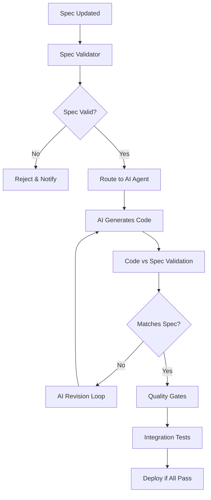

# 🤖 CONTINUOUS AI ARCHITECTURE - SPECS-DRIVEN DEVELOPMENT

## 🎯 **CORE PHILOSOPHY**

**Traditional CI/CD**: Code → Build → Test → Deploy
**Continuous AI**: **Spec → AI Code Generation → Validation → Integration**

### Key Principles:
1. **Specs are the source of truth** - All development starts with specifications
2. **Static infrastructure manages the pipeline** - n8n, cron jobs, PostgreSQL handle orchestration
3. **AI models fill coding gaps** - Claude Code/Qwen generate code based on specs
4. **Human oversight validates specs** - AI doesn't make architectural decisions
5. **Quality gates enforce spec compliance** - Code must match specifications exactly

---

## 🏗️ **ARCHITECTURE OVERVIEW**

```
📋 SPEC FILES                   🤖 AI AGENTS               🔧 STATIC PIPELINE
├── functional-specs.yaml  →   ├── Claude Code           ├── n8n Orchestrator
├── api-specs.openapi      →   ├── Qwen Coder           ├── PostgreSQL Tracking
├── database-specs.sql     →   └── Spec Validators      ├── Cron Schedulers
├── ui-specs.figma        →                             └── Quality Gates
└── test-specs.yaml       →
```

### **Flow:**
1. **Spec Creation/Update** → Triggers pipeline
2. **Static Orchestrator** → Validates specs, assigns to AI
3. **AI Code Generation** → Generates code matching specs exactly
4. **Automated Validation** → Tests code against specs
5. **Quality Gates** → Ensures spec compliance
6. **Integration** → Merges only if specs are met

---

## 📋 **SPECIFICATION-DRIVEN WORKFLOW**

### 1. **Specification Types**

```yaml
specs/
├── functional/
│   ├── user-stories.yaml
│   ├── acceptance-criteria.yaml
│   └── business-rules.yaml
├── technical/
│   ├── api-endpoints.openapi
│   ├── database-schema.sql
│   ├── data-models.json
│   └── integration-points.yaml
├── quality/
│   ├── test-scenarios.yaml
│   ├── performance-requirements.yaml
│   └── security-requirements.yaml
└── ui/
    ├── wireframes.figma
    ├── component-specs.yaml
    └── user-flows.yaml
```

### 2. **AI Agent Assignment**

```yaml
ai_agents:
  claude-code:
    specialties: ["frontend", "api", "documentation", "testing"]
    spec_types: ["ui-specs", "api-specs", "test-specs"]
    languages: ["typescript", "react", "node.js"]

  qwen:
    specialties: ["backend", "database", "algorithms", "optimization"]
    spec_types: ["database-specs", "functional-specs", "performance-specs"]
    languages: ["python", "go", "sql", "rust"]
```

### 3. **Spec-to-Code Process**



---

## 🛠️ **STATIC INFRASTRUCTURE COMPONENTS**

### **n8n Orchestration Workflows**

1. **Spec Change Detector**
   - Monitors spec files for changes
   - Validates spec syntax and completeness
   - Routes to appropriate AI agent

2. **AI Code Generation Manager**
   - Assigns coding tasks to AI agents
   - Monitors AI progress and output
   - Handles AI agent failures/retries

3. **Quality Gate Enforcer**
   - Runs automated tests against specs
   - Validates code coverage
   - Checks spec compliance

4. **Integration Pipeline**
   - Merges validated code
   - Runs full integration tests
   - Deploys to staging/production

### **PostgreSQL Data Model**

```sql
-- Specifications tracking
CREATE TABLE specs (
    id SERIAL PRIMARY KEY,
    spec_type VARCHAR(50), -- functional, technical, quality, ui
    file_path VARCHAR(500),
    version VARCHAR(20),
    ai_agent_assigned VARCHAR(50),
    implementation_status VARCHAR(50), -- pending, in_progress, completed, failed
    spec_hash VARCHAR(255), -- For change detection
    created_at TIMESTAMP,
    updated_at TIMESTAMP
);

-- AI Code Generation tracking
CREATE TABLE ai_code_generations (
    id SERIAL PRIMARY KEY,
    spec_id INTEGER REFERENCES specs(id),
    ai_agent VARCHAR(50), -- claude-code, qwen
    generated_code_path VARCHAR(500),
    generation_prompt TEXT,
    spec_compliance_score DECIMAL(5,2),
    attempt_number INTEGER,
    status VARCHAR(50), -- generating, completed, failed, revision_needed
    created_at TIMESTAMP
);

-- Spec Compliance validation
CREATE TABLE spec_validations (
    id SERIAL PRIMARY KEY,
    code_generation_id INTEGER REFERENCES ai_code_generations(id),
    validation_type VARCHAR(50), -- syntax, functionality, performance, security
    passed BOOLEAN,
    score DECIMAL(5,2),
    issues JSONB,
    validation_details TEXT,
    validated_at TIMESTAMP
);
```

### **Cron-Based Scheduling**

```bash
# Continuous spec monitoring (every 5 minutes)
*/5 * * * * /opt/pandora/check-spec-changes.sh

# AI agent health check (every hour)
0 * * * * /opt/pandora/ai-agent-health.sh

# Full spec-to-code validation (twice daily)
0 6,18 * * * /opt/pandora/full-spec-validation.sh

# Quality metrics reporting (daily)
0 8 * * * /opt/pandora/generate-ai-metrics.sh
```

---

## 🤖 **AI AGENT INTEGRATION POINTS**

### **Claude Code Integration**

```typescript
// Spec-driven code generation interface
interface SpecToCodeRequest {
  specId: string;
  specContent: any;
  targetLanguage: string;
  outputRequirements: {
    testCoverage: number;
    documentationLevel: 'minimal' | 'standard' | 'comprehensive';
    codeStyle: string;
  };
}

// AI agent response validation
interface CodeGenerationResponse {
  generatedCode: string;
  testSuite: string;
  documentation: string;
  specComplianceReport: {
    score: number;
    missedRequirements: string[];
    additionalFeatures: string[];
  };
}
```

### **Quality Gates for AI-Generated Code**

```yaml
quality_gates:
  spec_compliance:
    minimum_score: 95.0  # Must match spec 95%+
    blocking: true

  test_coverage:
    minimum_coverage: 85.0  # AI must generate tests
    blocking: true

  documentation:
    minimum_score: 80.0  # AI must document code
    blocking: false

  no_hallucination:
    check_undocumented_features: true  # Flag AI additions
    blocking: true
```

---

## 📊 **CONTINUOUS AI MONITORING**

### **Grafana Dashboard Metrics**

1. **Spec-to-Code Velocity**
   - Time from spec to working code
   - AI agent efficiency by language/domain
   - Revision cycles per spec

2. **AI Agent Performance**
   - Spec compliance scores
   - Code quality metrics
   - Successful implementation rate

3. **Spec Coverage**
   - Percentage of specs implemented
   - Pending specifications
   - Failed implementation attempts

4. **Quality Trends**
   - AI-generated code test coverage
   - Bug rates in AI code vs human code
   - Spec change frequency

---

## 🎯 **DEFINITION OF DONE - CONTINUOUS AI**

### **Required for Spec Implementation:**

✅ **Spec Compliance**: Code matches specification 95%+
✅ **Test Coverage**: AI-generated tests cover 85%+ of code
✅ **Documentation**: All public APIs documented by AI
✅ **Integration Tests**: Code integrates with existing system
✅ **Performance**: Meets spec performance requirements
✅ **Security**: Passes automated security scans
✅ **Human Review**: Architect approves spec interpretation

### **Quality Gates:**

1. **Spec Validation** → Spec is valid, complete, testable
2. **AI Code Generation** → Code matches spec requirements
3. **Automated Testing** → All tests pass, coverage adequate
4. **Integration Testing** → Works with existing system
5. **Security Validation** → No vulnerabilities introduced
6. **Performance Testing** → Meets spec performance criteria
7. **Human Approval** → Architect/Lead approves implementation

---

## 🚀 **IMPLEMENTATION BENEFITS**

### **Advantages of Continuous AI Approach:**

1. **Spec-Driven Quality** - Code always matches specifications
2. **Consistent Architecture** - AI follows established patterns
3. **Rapid Iteration** - Spec changes trigger immediate code updates
4. **Comprehensive Testing** - AI generates tests with code
5. **Living Documentation** - AI maintains docs as specs evolve
6. **Reduced Human Toil** - Focus on specs, not implementation details
7. **Audit Trail** - Complete traceability from spec to deployment

### **Risk Mitigation:**

1. **AI Hallucination** - Strict spec compliance validation
2. **Quality Regression** - Comprehensive automated testing
3. **Security Issues** - Automated security scanning
4. **Performance Impact** - Continuous performance monitoring
5. **Human Oversight** - Required approval gates

---

This approach transforms AI from a build tool into a **specification implementation engine**, maintaining human control over architecture while leveraging AI for rapid, consistent code generation.