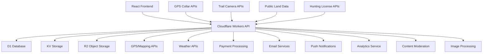

# GoHunta.com - Integration Specification

## Integration Architecture Overview

GoHunta.com requires seamless integration between frontend, backend, external APIs, and third-party services to deliver a cohesive experience for hunting dog enthusiasts. This specification defines all integration points, data flows, and comprehensive testing strategies.

## System Integration Map



## Frontend-Backend Integration

### API Communication Layer

#### Positive Test Cases
```gherkin
Feature: Frontend-Backend API Integration

Scenario: Successful API request with authentication
  Given an authenticated user with valid JWT token
  When frontend makes API request to "/api/dogs"
  Then request includes proper Authorization header
  And response returns 200 status code
  And response data matches expected schema
  And response headers include proper CORS settings

Scenario: Data synchronization between frontend and backend
  Given user creates hunt log on frontend
  When data is submitted to backend
  Then backend validates and stores data
  And returns created hunt log with ID
  And frontend updates local state
  And user sees confirmation message

Scenario: Real-time data updates via WebSocket
  Given user is viewing community feed
  When new post is created by another user
  Then WebSocket pushes update to frontend
  And new post appears without page refresh
  And user receives subtle notification
  And connection state is maintained

Scenario: Offline data synchronization
  Given user creates content while offline
  When internet connection is restored
  Then frontend queues offline changes
  And sends changes to backend in order
  And backend processes changes sequentially
  And conflicts are resolved appropriately
  And user is notified of sync completion
```

#### Negative Test Cases
```gherkin
Scenario: API request with expired token
  Given user with expired JWT token
  When frontend makes authenticated API request
  Then backend returns 401 Unauthorized
  And frontend detects authentication failure
  And automatic token refresh is attempted
  And user is redirected to login if refresh fails
  And original request is retried after re-auth

Scenario: Network timeout during API request
  Given unstable network connection
  When API request takes longer than timeout limit
  Then frontend displays loading state appropriately
  And request is automatically retried with backoff
  And user is informed of network issues
  And graceful degradation is provided
  And cached data is shown when available

Scenario: API server error response
  Given backend service experiencing issues
  When frontend makes API request
  Then backend returns 500 error
  And frontend handles error gracefully
  And user sees helpful error message
  And retry mechanism is offered
  And error is logged for debugging

Scenario: Data validation failure
  Given user submits invalid form data
  When frontend sends data to backend
  Then backend validates and rejects data
  And returns detailed validation errors
  And frontend displays field-specific errors
  And user can correct issues and resubmit
  And valid data is preserved during correction
```

#### Step Classes (API Integration)
```typescript
// api-integration-steps.ts
export class APIIntegrationSteps {
  private baseURL = process.env.API_BASE_URL || 'http://localhost:8787';
  private authToken: string | null = null;

  async authenticateUser(credentials: LoginCredentials) {
    const response = await fetch(`${this.baseURL}/api/auth/login`, {
      method: 'POST',
      headers: { 'Content-Type': 'application/json' },
      body: JSON.stringify(credentials)
    });

    expect(response.status).toBe(200);
    const data = await response.json();
    expect(data.token).toBeDefined();
    
    this.authToken = data.token;
    return data;
  }

  async makeAuthenticatedRequest(endpoint: string, options: RequestInit = {}) {
    const response = await fetch(`${this.baseURL}${endpoint}`, {
      ...options,
      headers: {
        'Content-Type': 'application/json',
        'Authorization': `Bearer ${this.authToken}`,
        ...options.headers
      }
    });

    return {
      status: response.status,
      data: await response.json(),
      headers: response.headers
    };
  }

  async testWebSocketConnection() {
    return new Promise((resolve, reject) => {
      const ws = new WebSocket(`${this.baseURL.replace('http', 'ws')}/api/ws`);
      
      ws.onopen = () => {
        expect(ws.readyState).toBe(WebSocket.OPEN);
        resolve(ws);
      };

      ws.onerror = (error) => reject(error);
      
      setTimeout(() => reject(new Error('WebSocket connection timeout')), 5000);
    });
  }

  async testOfflineSync() {
    // Create offline data
    const offlineData = {
      huntLogs: [this.createMockHuntLog()],
      dogProfiles: [this.createMockDogProfile()],
      timestamp: new Date().toISOString()
    };

    // Store in local storage (simulating offline state)
    localStorage.setItem('offlineData', JSON.stringify(offlineData));

    // Simulate connection restoration
    const syncResponse = await this.makeAuthenticatedRequest('/api/sync', {
      method: 'POST',
      body: JSON.stringify(offlineData)
    });

    expect(syncResponse.status).toBe(200);
    expect(syncResponse.data.processed).toBe(offlineData.huntLogs.length + offlineData.dogProfiles.length);
  }

  validateResponseSchema(data: any, expectedSchema: any) {
    // Use a schema validation library like Joi or Zod
    const result = expectedSchema.validate(data);
    expect(result.error).toBeUndefined();
    return result.value;
  }
}
```

## External API Integrations

### GPS and Mapping Services Integration

#### Positive Test Cases
```gherkin
Feature: GPS and Mapping Integration

Scenario: Fetch public hunting lands data
  Given user planning hunt in Montana
  When requesting public lands in area
  Then system calls USGS public lands API
  And validates API response format
  And caches results for offline use
  And returns formatted boundary data
  And displays hunting-accessible areas only

Scenario: Route planning with elevation data
  Given user creating hunt route
  When requesting elevation profile
  Then system calls elevation API with route coordinates
  And processes elevation data points
  And generates elevation chart
  And calculates route difficulty rating
  And provides terrain warnings if applicable

Scenario: Real-time GPS tracking during hunt
  Given user starting hunt with GPS tracking
  When GPS positions are captured
  Then coordinates are validated for accuracy
  And positions are stored locally first
  And route is drawn in real-time
  And waypoints are marked for game contacts
  And battery optimization is maintained
```

#### Negative Test Cases
```gherkin
Scenario: GPS API rate limit exceeded
  Given excessive GPS API requests
  When rate limit is hit
  Then system handles API rate limiting gracefully
  And falls back to cached map data
  And queues requests for later processing
  And informs user of temporary limitations
  And provides offline navigation options

Scenario: Invalid GPS coordinates from device
  Given GPS hardware providing invalid coordinates
  When coordinates are outside valid ranges
  Then system validates coordinate bounds
  And rejects invalid GPS data
  And uses last known good position
  And alerts user to GPS issues
  And suggests troubleshooting steps
```

#### Step Classes (GPS Integration)
```typescript
// gps-integration-steps.ts
export class GPSIntegrationSteps {
  private gpsAPIKey = process.env.GPS_API_KEY;
  private elevationAPIKey = process.env.ELEVATION_API_KEY;

  async fetchPublicLands(bounds: GeoBounds) {
    const response = await fetch(
      `https://api.usgs.gov/public-lands?bounds=${bounds.toString()}&key=${this.gpsAPIKey}`
    );

    expect(response.status).toBe(200);
    const data = await response.json();
    
    // Validate response structure
    expect(data.features).toBeDefined();
    expect(Array.isArray(data.features)).toBe(true);
    
    return data;
  }

  async getElevationProfile(coordinates: Coordinate[]) {
    const coordString = coordinates.map(c => `${c.lat},${c.lng}`).join('|');
    
    const response = await fetch(
      `https://api.elevation.service.com/profile?coordinates=${coordString}&key=${this.elevationAPIKey}`
    );

    expect(response.status).toBe(200);
    const elevationData = await response.json();
    
    expect(elevationData.elevation).toBeDefined();
    expect(elevationData.elevation.length).toBe(coordinates.length);
    
    return elevationData;
  }

  validateGPSCoordinates(lat: number, lng: number): boolean {
    return (
      lat >= -90 && lat <= 90 &&
      lng >= -180 && lng <= 180 &&
      !isNaN(lat) && !isNaN(lng)
    );
  }

  async testGPSTracking() {
    const mockPositions: GeolocationPosition[] = [];
    
    // Mock GPS position updates
    const watchId = navigator.geolocation.watchPosition(
      (position) => {
        expect(this.validateGPSCoordinates(
          position.coords.latitude,
          position.coords.longitude
        )).toBe(true);
        
        mockPositions.push(position);
      },
      (error) => {
        expect(error.code).toBeOneOf([
          GeolocationPositionError.PERMISSION_DENIED,
          GeolocationPositionError.POSITION_UNAVAILABLE,
          GeolocationPositionError.TIMEOUT
        ]);
      },
      { enableHighAccuracy: true, timeout: 10000 }
    );

    // Test for reasonable number of position updates
    await new Promise(resolve => setTimeout(resolve, 5000));
    expect(mockPositions.length).toBeGreaterThan(0);
    
    navigator.geolocation.clearWatch(watchId);
  }
}
```

### Weather API Integration

#### Positive Test Cases
```gherkin
Feature: Weather Data Integration

Scenario: Fetch current hunting conditions
  Given user planning hunt for specific location
  When requesting current weather data
  Then system calls weather API with coordinates
  And receives current conditions
  And processes hunting-relevant data
  And provides wind direction and speed
  And includes visibility and precipitation
  And caches data for offline access

Scenario: Weekly weather forecast for hunt planning
  Given user planning hunt for next week
  When requesting extended forecast
  Then system fetches 7-day forecast
  And identifies optimal hunting days
  And highlights poor weather conditions
  And provides temperature ranges
  And includes sunrise/sunset times
  And suggests best hunting hours
```

#### Step Classes (Weather Integration)
```typescript
// weather-integration-steps.ts
export class WeatherIntegrationSteps {
  private weatherAPIKey = process.env.WEATHER_API_KEY;

  async getCurrentWeather(lat: number, lng: number) {
    const response = await fetch(
      `https://api.weather.service.com/current?lat=${lat}&lng=${lng}&key=${this.weatherAPIKey}`
    );

    expect(response.status).toBe(200);
    const weather = await response.json();
    
    // Validate required hunting weather data
    expect(weather.temperature).toBeDefined();
    expect(weather.windSpeed).toBeDefined();
    expect(weather.windDirection).toBeDefined();
    expect(weather.visibility).toBeDefined();
    expect(weather.conditions).toBeDefined();
    
    return weather;
  }

  async getHuntingForecast(lat: number, lng: number) {
    const response = await fetch(
      `https://api.weather.service.com/forecast?lat=${lat}&lng=${lng}&days=7&key=${this.weatherAPIKey}`
    );

    expect(response.status).toBe(200);
    const forecast = await response.json();
    
    expect(forecast.days).toBeDefined();
    expect(forecast.days.length).toBe(7);
    
    // Validate each day has hunting-relevant data
    forecast.days.forEach((day: any) => {
      expect(day.sunrise).toBeDefined();
      expect(day.sunset).toBeDefined();
      expect(day.windSpeed).toBeDefined();
      expect(day.precipitation).toBeDefined();
    });
    
    return forecast;
  }

  calculateHuntingScore(weather: WeatherData): number {
    let score = 100;
    
    // Deduct points for poor hunting conditions
    if (weather.windSpeed > 20) score -= 30; // High wind
    if (weather.precipitation > 50) score -= 40; // Heavy rain
    if (weather.temperature < 10 || weather.temperature > 85) score -= 20; // Extreme temps
    if (weather.visibility < 1000) score -= 25; // Poor visibility
    
    return Math.max(0, score);
  }
}
```

### Payment Processing Integration

#### Positive Test Cases
```gherkin
Feature: Payment Processing Integration

Scenario: Successful subscription payment
  Given user upgrading to premium subscription
  When payment is processed through Stripe
  Then payment intent is created successfully
  And payment method is validated
  And subscription is activated immediately
  And user receives confirmation email
  And access to premium features is granted

Scenario: Failed payment handling
  Given user with declined credit card
  When subscription payment is attempted
  Then payment failure is handled gracefully
  And specific error message is provided
  And user can update payment method
  And retry mechanism is available
  And subscription grace period is honored
```

#### Step Classes (Payment Integration)
```typescript
// payment-integration-steps.ts
export class PaymentIntegrationSteps {
  private stripeKey = process.env.STRIPE_TEST_KEY;

  async createPaymentIntent(amount: number, currency: string = 'usd') {
    const response = await fetch('/api/payments/create-intent', {
      method: 'POST',
      headers: {
        'Content-Type': 'application/json',
        'Authorization': `Bearer ${this.authToken}`
      },
      body: JSON.stringify({ amount, currency })
    });

    expect(response.status).toBe(200);
    const paymentIntent = await response.json();
    
    expect(paymentIntent.client_secret).toBeDefined();
    expect(paymentIntent.amount).toBe(amount);
    expect(paymentIntent.currency).toBe(currency);
    
    return paymentIntent;
  }

  async processTestPayment(paymentMethodId: string, amount: number) {
    const paymentIntent = await this.createPaymentIntent(amount);
    
    // Simulate Stripe payment confirmation
    const confirmResponse = await fetch('/api/payments/confirm', {
      method: 'POST',
      headers: {
        'Content-Type': 'application/json',
        'Authorization': `Bearer ${this.authToken}`
      },
      body: JSON.stringify({
        payment_intent_id: paymentIntent.id,
        payment_method_id: paymentMethodId
      })
    });

    expect(confirmResponse.status).toBe(200);
    const result = await confirmResponse.json();
    
    expect(result.status).toBe('succeeded');
    return result;
  }

  async testSubscriptionUpgrade() {
    const subscriptionResponse = await fetch('/api/subscriptions/upgrade', {
      method: 'POST',
      headers: {
        'Content-Type': 'application/json',
        'Authorization': `Bearer ${this.authToken}`
      },
      body: JSON.stringify({
        tier: 'premium',
        payment_method_id: 'pm_test_4242424242424242'
      })
    });

    expect(subscriptionResponse.status).toBe(200);
    const subscription = await subscriptionResponse.json();
    
    expect(subscription.status).toBe('active');
    expect(subscription.tier).toBe('premium');
    
    return subscription;
  }
}
```

## Hardware Device Integrations

### GPS Collar Integration

#### Positive Test Cases
```gherkin
Feature: GPS Collar Integration

Scenario: Sync GPS collar data
  Given user with supported GPS collar
  When collar data sync is initiated
  Then system connects to collar API
  And retrieves dog location history
  And imports tracking data
  And associates data with specific dog
  And updates hunt logs with collar data

Scenario: Real-time collar tracking
  Given dog wearing GPS collar during hunt
  When real-time tracking is enabled
  Then collar positions stream to app
  And dog location is displayed on map
  And geofence alerts work properly
  And battery status is monitored
  And data is stored for later analysis
```

#### Step Classes (GPS Collar Integration)
```typescript
// gps-collar-steps.ts
export class GPSCollarSteps {
  async connectToCollar(collarId: string, collarType: string) {
    const response = await fetch('/api/devices/collars/connect', {
      method: 'POST',
      headers: {
        'Content-Type': 'application/json',
        'Authorization': `Bearer ${this.authToken}`
      },
      body: JSON.stringify({ collarId, collarType })
    });

    expect(response.status).toBe(200);
    const connection = await response.json();
    
    expect(connection.connected).toBe(true);
    expect(connection.deviceId).toBe(collarId);
    
    return connection;
  }

  async syncCollarData(collarId: string, startDate: string, endDate: string) {
    const response = await fetch('/api/devices/collars/sync', {
      method: 'POST',
      headers: {
        'Content-Type': 'application/json',
        'Authorization': `Bearer ${this.authToken}`
      },
      body: JSON.stringify({ collarId, startDate, endDate })
    });

    expect(response.status).toBe(200);
    const syncResult = await response.json();
    
    expect(syncResult.trackingPoints).toBeDefined();
    expect(Array.isArray(syncResult.trackingPoints)).toBe(true);
    expect(syncResult.syncedCount).toBeGreaterThan(0);
    
    return syncResult;
  }

  async setupGeofenceAlerts(collarId: string, boundaries: GeofenceBoundary[]) {
    const response = await fetch('/api/devices/collars/geofence', {
      method: 'POST',
      headers: {
        'Content-Type': 'application/json',
        'Authorization': `Bearer ${this.authToken}`
      },
      body: JSON.stringify({ collarId, boundaries })
    });

    expect(response.status).toBe(200);
    const geofence = await response.json();
    
    expect(geofence.active).toBe(true);
    expect(geofence.boundaries.length).toBe(boundaries.length);
    
    return geofence;
  }
}
```

## End-to-End Integration Testing

### Complete User Journey Tests

#### Positive Test Cases
```gherkin
Feature: Complete User Journey Integration

Scenario: Full hunt planning and execution workflow
  Given new user registers for GoHunta account
  When they complete onboarding process
  Then they can create dog profiles
  And plan hunt using GPS and weather data
  And log hunt with photos and GPS tracking
  And share experience in community
  And review hunting gear used
  And sync data across all devices

Scenario: Multi-user hunt coordination
  Given multiple users planning group hunt
  When hunt organizer creates group event
  Then all participants receive notifications
  And can coordinate dogs and equipment
  And share real-time locations during hunt
  And contribute to group hunt log
  And split costs through payment system
```

#### Step Classes (End-to-End Integration)
```typescript
// e2e-integration-steps.ts
export class E2EIntegrationSteps {
  async completeUserOnboarding() {
    // Register new user
    const registration = await this.registerNewUser();
    expect(registration.success).toBe(true);

    // Verify email
    await this.verifyUserEmail(registration.user.email);

    // Complete profile
    const profile = await this.completeUserProfile();
    expect(profile.completed).toBe(true);

    // Create first dog profile
    const dog = await this.createFirstDogProfile();
    expect(dog.id).toBeDefined();

    return { user: registration.user, dog };
  }

  async planAndExecuteHunt() {
    // Get weather forecast
    const weather = await this.getWeatherForecast();
    expect(weather.days.length).toBe(7);

    // Plan hunt route
    const route = await this.planHuntRoute();
    expect(route.waypoints.length).toBeGreaterThan(2);

    // Start hunt tracking
    const huntSession = await this.startHuntTracking();
    expect(huntSession.active).toBe(true);

    // Simulate hunt activities
    await this.simulateHuntActivities();

    // End hunt and create log
    const huntLog = await this.endHuntAndCreateLog();
    expect(huntLog.id).toBeDefined();

    return huntLog;
  }

  async testCrossDeviceSynchronization() {
    // Create data on device 1
    const device1Data = await this.createDataOnDevice1();

    // Switch to device 2
    await this.switchToDevice2();

    // Verify data sync
    const device2Data = await this.fetchDataOnDevice2();
    expect(device2Data.length).toBe(device1Data.length);

    // Modify data on device 2
    await this.modifyDataOnDevice2();

    // Switch back to device 1
    await this.switchToDevice1();

    // Verify changes synced
    const updatedData = await this.fetchUpdatedDataOnDevice1();
    expect(updatedData.lastModified).toBeGreaterThan(device1Data.lastModified);
  }

  async testOfflineToOnlineWorkflow() {
    // Go offline
    await this.simulateOfflineMode();

    // Create offline content
    const offlineData = await this.createOfflineContent();
    expect(offlineData.stored_locally).toBe(true);

    // Verify offline functionality
    await this.verifyOfflineFunctionality();

    // Restore connectivity
    await this.restoreConnectivity();

    // Verify data sync
    const syncResult = await this.verifySyncCompletion();
    expect(syncResult.conflicts_resolved).toBe(0);
    expect(syncResult.items_synced).toBe(offlineData.items.length);
  }
}
```

### Performance Integration Testing

```typescript
// performance-integration-tests.ts
describe('Performance Integration Tests', () => {
  test('should handle concurrent user load', async () => {
    const concurrentUsers = 100;
    const promises = [];

    for (let i = 0; i < concurrentUsers; i++) {
      promises.push(simulateUserSession());
    }

    const results = await Promise.all(promises);
    const successfulSessions = results.filter(r => r.success).length;
    
    expect(successfulSessions).toBeGreaterThan(concurrentUsers * 0.95); // 95% success rate
  });

  test('should maintain performance under data load', async () => {
    // Create large dataset
    await createLargeDataset();

    const startTime = performance.now();
    
    // Perform typical operations
    await Promise.all([
      fetchHuntLogs(),
      searchCommunityPosts(),
      loadDogProfiles(),
      generateAnalytics()
    ]);

    const endTime = performance.now();
    const duration = endTime - startTime;

    expect(duration).toBeLessThan(2000); // Under 2 seconds
  });
});
```

## Integration Monitoring and Alerting

### Health Check Integration
```typescript
// integration-health-checks.ts
export class IntegrationHealthChecks {
  async checkAllIntegrations() {
    const checks = await Promise.allSettled([
      this.checkDatabaseConnection(),
      this.checkExternalAPIs(),
      this.checkPaymentProcessing(),
      this.checkEmailService(),
      this.checkFileStorage(),
      this.checkPushNotifications()
    ]);

    const results = checks.map((check, index) => ({
      service: this.getServiceName(index),
      status: check.status === 'fulfilled' ? 'healthy' : 'unhealthy',
      details: check.status === 'fulfilled' ? check.value : check.reason
    }));

    return {
      overall: results.every(r => r.status === 'healthy') ? 'healthy' : 'degraded',
      services: results,
      timestamp: new Date().toISOString()
    };
  }

  async checkExternalAPIs() {
    const apis = [
      { name: 'GPS Service', url: '/api/health/gps' },
      { name: 'Weather Service', url: '/api/health/weather' },
      { name: 'Mapping Service', url: '/api/health/maps' },
      { name: 'Payment Service', url: '/api/health/payments' }
    ];

    const results = await Promise.all(
      apis.map(async (api) => {
        const startTime = Date.now();
        try {
          const response = await fetch(api.url, { timeout: 5000 });
          const responseTime = Date.now() - startTime;
          
          return {
            name: api.name,
            status: response.ok ? 'healthy' : 'unhealthy',
            responseTime: responseTime,
            httpStatus: response.status
          };
        } catch (error) {
          return {
            name: api.name,
            status: 'unhealthy',
            responseTime: Date.now() - startTime,
            error: error.message
          };
        }
      })
    );

    return results;
  }
}
```

This integration specification provides comprehensive testing coverage for all system integrations, ensuring reliable communication between all components of the GoHunta platform while maintaining the high reliability needed for outdoor hunting environments.