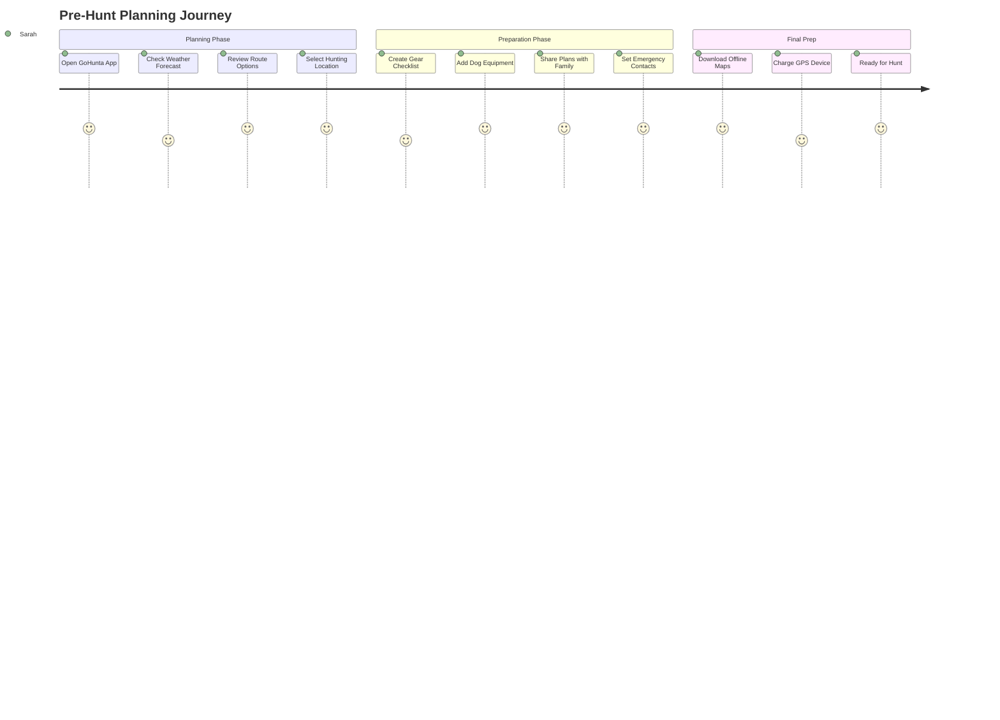
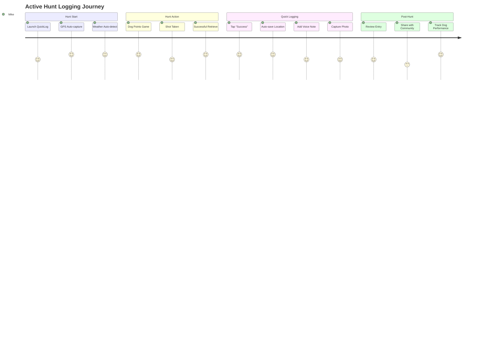
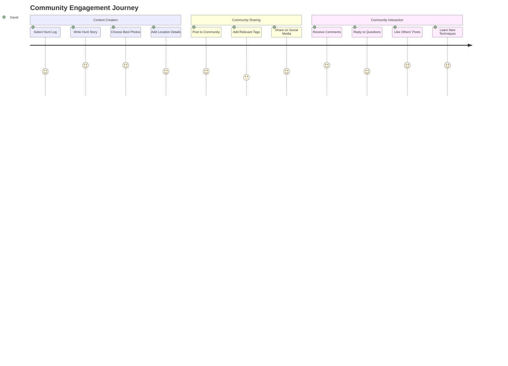

# User Journey Maps - GoHunta.com

## Overview

User journey maps for GoHunta.com focus on the unique workflows of hunters using working dogs in various field conditions. These maps prioritize mobile-first experiences, offline functionality, and quick access to critical features during active hunts.

## Primary User Personas

### 1. Field Hunter (Primary)
- **Profile**: Active hunter, uses dogs, hunts in remote areas
- **Devices**: iPhone/Android, often with protective case
- **Context**: Limited connectivity, wearing gloves, time-sensitive actions
- **Goals**: Quick logging, dog tracking, safety features, community sharing

### 2. Training Enthusiast
- **Profile**: Focuses on dog training and development
- **Devices**: Tablet/smartphone for detailed tracking
- **Context**: Training grounds, regular connectivity
- **Goals**: Performance tracking, progress monitoring, training logs

### 3. Community Member
- **Profile**: Engages with hunting community, shares experiences
- **Devices**: Multiple devices, good connectivity
- **Context**: Home/office browsing, social interaction
- **Goals**: Content sharing, learning, community engagement

## Core User Journeys

### Journey 1: Pre-Hunt Planning

#### Scenario
Sarah is planning a weekend hunt with her two pointers. She needs to check weather, plan routes, and prepare her gear list.

#### Journey Flow



#### Touchpoints & Pain Points

| Stage | Touchpoint | User Emotion | Pain Points | Opportunities |
|-------|------------|--------------|-------------|---------------|
| **Weather Check** | Weather widget | Anxious | Inaccurate forecasts | Real-time updates, multiple sources |
| **Route Planning** | Route planner | Excited | Complex interface | Simplified mobile UI, saved routes |
| **Gear Prep** | Checklist tool | Focused | Missing items | Smart suggestions, previous hunt data |
| **Offline Prep** | Download manager | Concerned | Storage limits | Efficient compression, selective downloads |

#### UI/UX Requirements

**Mobile Interface**
```css
.pre-hunt-dashboard {
  display: grid;
  grid-template-rows: auto 1fr auto;
  height: 100vh;
  padding: var(--space-4);
}

.weather-card {
  background: linear-gradient(135deg, var(--water-blue), var(--dawn-light));
  color: white;
  padding: var(--space-6);
  border-radius: 12px;
  margin-bottom: var(--space-4);
}

.quick-actions {
  position: fixed;
  bottom: var(--space-4);
  right: var(--space-4);
  display: flex;
  flex-direction: column;
  gap: var(--space-2);
}
```

### Journey 2: Active Hunt Logging

#### Scenario
Mike is in the field with his retriever. He gets a successful retrieve and needs to quickly log the hunt while maintaining focus on his dog and surroundings.

#### Journey Flow



#### Touchpoints & Pain Points

| Stage | Touchpoint | User Emotion | Pain Points | Opportunities |
|-------|------------|--------------|-------------|---------------|
| **GPS Capture** | Location service | Anxious | Slow/inaccurate GPS | Pre-warming, high accuracy mode |
| **Quick Entry** | QuickLog button | Urgent | Small touch targets | Large, glove-friendly buttons |
| **Voice Note** | Microphone | Excited | Wind noise, clarity | Noise cancellation, transcription |
| **Photo Capture** | Camera | Satisfied | Glare, focus issues | Auto-adjust, burst mode |

#### Field-Optimized UI

```css
.quick-log-overlay {
  position: fixed;
  inset: 0;
  background: rgba(0, 0, 0, 0.8);
  display: flex;
  align-items: center;
  justify-content: center;
  z-index: 1000;
}

.hunt-success-button {
  background: var(--success);
  min-height: 64px;
  min-width: 150px;
  font-size: var(--text-xl);
  font-weight: var(--font-bold);
  border-radius: 12px;
  box-shadow: 0 4px 12px rgba(16, 185, 129, 0.3);
}

.glove-friendly {
  touch-action: manipulation;
  user-select: none;
  -webkit-touch-callout: none;
}
```

### Journey 3: Dog Training Session

#### Scenario
Lisa is conducting a training session with her young setter. She wants to track progress, note behaviors, and monitor improvement over time.

#### Journey Flow


#### Touchpoints & Pain Points

| Stage | Touchpoint | User Emotion | Pain Points | Opportunities |
|-------|------------|--------------|-------------|---------------|
| **Session Setup** | Training module | Focused | Complex configuration | Quick templates, previous sessions |
| **Performance Tracking** | Scoring interface | Analytical | Subjective scoring | Standardized metrics, video analysis |
| **Note Taking** | Text input | Frustrated | Typing while handling dog | Voice notes, quick tags |
| **Progress Review** | Analytics dashboard | Satisfied | Information overload | Clear trends, actionable insights |

#### Training-Optimized Interface

```css
.training-session {
  display: grid;
  grid-template-areas: 
    "timer controls"
    "notes notes"
    "metrics metrics";
  grid-template-rows: auto 1fr auto;
  height: 100vh;
  padding: var(--space-4);
}

.session-timer {
  grid-area: timer;
  font-size: var(--text-3xl);
  font-weight: var(--font-bold);
  font-family: var(--font-mono);
  text-align: center;
  background: var(--neutral-100);
  border-radius: 8px;
  padding: var(--space-4);
}

.quick-score-buttons {
  display: flex;
  gap: var(--space-2);
  margin: var(--space-4) 0;
}

.score-button {
  flex: 1;
  min-height: 56px;
  font-size: var(--text-lg);
  font-weight: var(--font-bold);
}
```

### Journey 4: Community Engagement

#### Scenario
David wants to share his successful hunt story and photos with the hunting community, get feedback on his dog's performance, and learn from other hunters' experiences.

#### Journey Flow



#### Touchpoints & Pain Points

| Stage | Touchpoint | User Emotion | Pain Points | Opportunities |
|-------|------------|--------------|-------------|---------------|
| **Content Creation** | Post composer | Creative | Photo selection/editing | AI-assisted curation, filters |
| **Story Writing** | Text editor | Enthusiastic | Mobile typing | Voice-to-text, templates |
| **Community Feed** | Social feed | Engaged | Information overload | Personalized content, filters |
| **Interactions** | Comments/likes | Social | Managing notifications | Smart grouping, priority alerts |

#### Community Interface Design

```css
.community-feed {
  display: flex;
  flex-direction: column;
  max-width: 600px;
  margin: 0 auto;
  padding: var(--space-4);
}

.hunt-story-card {
  background: var(--neutral-50);
  border: 1px solid var(--neutral-200);
  border-radius: 12px;
  margin-bottom: var(--space-6);
  overflow: hidden;
  box-shadow: 0 2px 8px rgba(0, 0, 0, 0.1);
}

.story-header {
  display: flex;
  align-items: center;
  padding: var(--space-4);
  gap: var(--space-3);
}

.story-content {
  padding: 0 var(--space-4) var(--space-4);
  line-height: var(--leading-relaxed);
}

.story-actions {
  display: flex;
  justify-content: space-between;
  align-items: center;
  padding: var(--space-4);
  border-top: 1px solid var(--neutral-200);
}
```

### Journey 5: Emergency Situation

#### Scenario
Tom's dog has gone missing during a hunt in unfamiliar territory. He needs to quickly access emergency features, share his location, and coordinate with help.

#### Journey Flow


#### Touchpoints & Pain Points

| Stage | Touchpoint | User Emotion | Pain Points | Opportunities |
|-------|------------|--------------|-------------|---------------|
| **Emergency Access** | Emergency button | Panicked | Hard to find feature | Prominent placement, gesture trigger |
| **Location Sharing** | GPS sharing | Anxious | Inaccurate location | High precision mode, offline backup |
| **Communication** | Emergency contacts | Desperate | No signal coverage | Satellite messaging, mesh networks |
| **Community Alert** | Alert system | Hopeful | Limited reach | Automated nearby user alerts |

#### Emergency UI Design

```css
.emergency-mode {
  background: var(--error);
  color: var(--neutral-50);
  position: fixed;
  inset: 0;
  z-index: 9999;
  display: flex;
  flex-direction: column;
  padding: var(--space-6);
}

.emergency-header {
  text-align: center;
  margin-bottom: var(--space-8);
}

.emergency-title {
  font-size: var(--text-3xl);
  font-weight: var(--font-bold);
  margin-bottom: var(--space-2);
}

.emergency-actions {
  display: grid;
  grid-template-columns: 1fr;
  gap: var(--space-4);
  margin-bottom: var(--space-8);
}

.emergency-button {
  background: var(--neutral-50);
  color: var(--error);
  min-height: 64px;
  font-size: var(--text-xl);
  font-weight: var(--font-bold);
  border: 3px solid var(--neutral-50);
}

.emergency-button:hover {
  background: var(--error-light);
}
```

## Cross-Journey Patterns

### Consistent Navigation
- **Bottom Tab Bar**: Always accessible primary navigation
- **Quick Actions**: Floating buttons for critical actions
- **Gesture Support**: Swipe back, pull-to-refresh
- **Voice Commands**: Hands-free operation where possible

### Data Persistence
- **Auto-save**: Continuous saving of user input
- **Offline Queue**: Store actions when offline
- **Sync Status**: Clear indication of sync state
- **Recovery**: Restore interrupted sessions

### Accessibility Across Journeys
- **High Contrast**: Available in all interfaces
- **Large Text**: Scalable typography system
- **Voice Navigation**: Screen reader optimization
- **Motor Accessibility**: Alternative input methods

## Performance Considerations

### Journey-Specific Optimizations

**Pre-Hunt Planning**
- Pre-cache weather data and maps
- Background sync of route information
- Efficient image compression for gear photos

**Active Hunt Logging**
- GPS pre-warming to reduce acquisition time
- Optimized camera startup
- Minimal battery drain during logging

**Training Sessions**
- Real-time performance tracking
- Video compression for storage
- Battery-conscious timer functions

**Community Engagement**
- Image optimization for mobile networks
- Progressive loading of content
- Efficient notification handling

**Emergency Response**
- Fastest possible GPS lock
- Priority network connections
- Minimal interface for maximum speed

## Testing Framework for Journey Validation

### Scenario-Based Testing
```javascript
describe('Active Hunt Logging Journey', () => {
  it('completes full logging workflow in under 30 seconds', async () => {
    const startTime = performance.now();
    
    // Simulate journey steps
    await openQuickLog();
    await waitForGPSLock();
    await selectHuntOutcome('success');
    await capturePhoto();
    await saveHuntLog();
    
    const totalTime = performance.now() - startTime;
    expect(totalTime).toBeLessThan(30000);
  });
});
```

### Field Condition Testing
- Network interruption scenarios
- Battery drain simulations
- GPS accuracy variations
- Temperature/humidity impacts
- Glove operation testing

## Journey Metrics & KPIs

### Success Metrics
- **Time to Complete**: Journey completion time
- **Abandonment Rate**: Where users drop off
- **Error Recovery**: How users handle failures
- **Satisfaction Score**: Post-journey feedback

### Technical Metrics
- **GPS Acquisition Time**: Speed of location lock
- **Offline Functionality**: Feature availability offline
- **Battery Impact**: Power consumption per journey
- **Network Efficiency**: Data usage optimization

## Related Documentation

- [Component Library](../components/README.md)
- [Accessibility Guidelines](../accessibility/README.md)
- [Testing Framework](../testing/README.md)
- [Performance Specifications](../../performance/README.md)